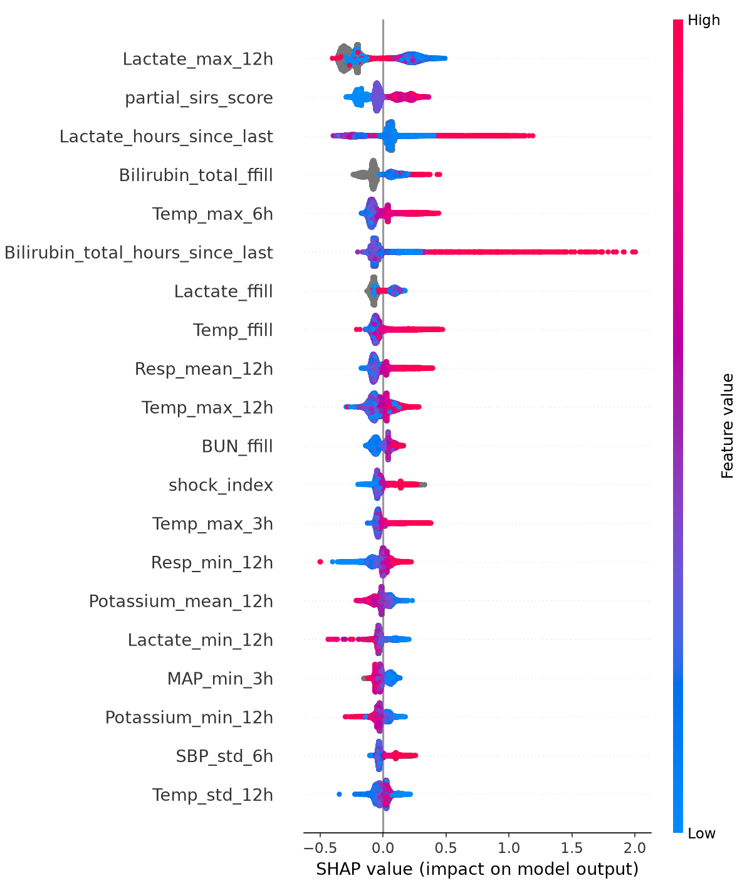
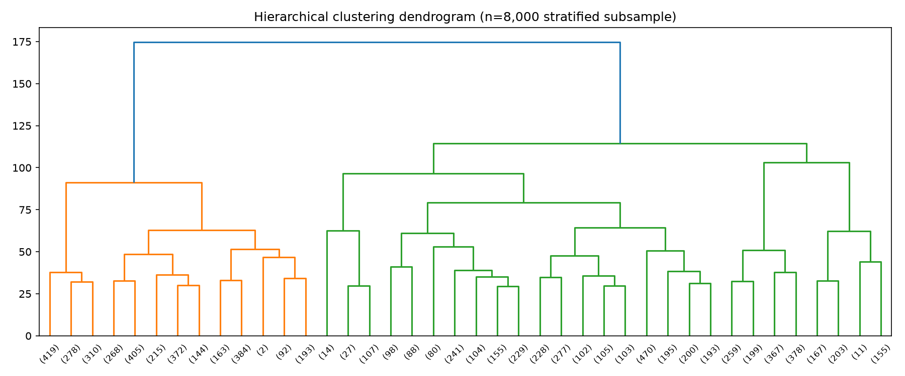

# Early Warning System for Sepsis Onset Using Dynamic Physiological Telemetry

A capstone project predicting sepsis onset **6 hours ahead** from hourly ICU vitals and labs, built on the real **PhysioNet/CinC Challenge 2019** dataset. Built for the "Data Warehouse and Mining" (DWM) and "Feature Engineering" (FE) subjects, B.Tech AI & Data Science, Sem V.

> **Note on the title:** this is deliberately named *"...Sepsis Onset..."* and not the broader *"...Patient Deterioration..."* used in the original course proposal, because that is what `SepsisLabel` — the actual target variable — measures. Calling it "deterioration" would overstate what the model is trained on.

---

## Table of contents

1. [Dataset](#1-dataset)
2. [Pipeline overview](#2-pipeline-overview)
3. [Script-by-script walkthrough](#3-script-by-script-walkthrough)
4. [Key engineering incident: the OOM crash](#4-key-engineering-incident-the-oom-crash)
5. [Leakage handling](#5-leakage-handling)
6. [Syllabus gap analysis](#6-syllabus-gap-analysis-why-scripts-07-09-exist)
7. [Results summary](#7-results-summary)
8. [Known limitations / honest caveats](#8-known-limitations--honest-caveats)
9. [Repository structure & how to reproduce](#9-repository-structure--how-to-reproduce)
10. [Pending work](#10-pending-work)

---

## 1. Dataset

The [PhysioNet/Computing in Cardiology Challenge 2019](https://physionet.org/content/challenge-2019/) dataset:

| | |
|---|---|
| Patients | 40,336 |
| Patient-hours | 1,552,210 |
| Positive (septic) hour rate | 1.8% |
| Raw features per hour | 40 vitals/labs + demographics (`HR`, `O2Sat`, `Temp`, `SBP`, `MAP`, `DBP`, `Resp`, `EtCO2`, `BaseExcess`, `HCO3`, `FiO2`, `pH`, `PaCO2`, `SaO2`, `AST`, `BUN`, `Alkalinephos`, `Calcium`, `Chloride`, `Creatinine`, `Bilirubin_direct`, `Glucose`, `Lactate`, `Magnesium`, `Phosphate`, `Potassium`, `Bilirubin_total`, `TroponinI`, `Hct`, `Hgb`, `PTT`, `WBC`, `Fibrinogen`, `Platelets`) |
| Target | `SepsisLabel`, defined via Sepsis-3 criteria, shifted to represent "sepsis within the next 6h" |
| Hospitals | 2 (`hospital_system_1`, `hospital_system_2`) |

This is a genuinely hard, severely imbalanced clinical prediction task — 1.8% positive rate means a model that always predicts "no sepsis" is already 98.2% accurate, which is exactly why AUROC/AUPRC, not accuracy, are used to judge it throughout this project.

---

## 2. Pipeline overview

Scripts live in `src/` and are numbered in execution order:

```
01_etl_warehouse.py           raw .psv  ->  DuckDB star schema
02_feature_engineering.py     star schema  ->  294-column engineered feature table
03_baseline_model.py          XGBoost on 15 raw features (control)
04_engineered_model.py        XGBoost on full engineered feature set + DeLong test + ablation
05_explainability.py          SHAP analysis on the engineered model
06_leadtime_alarm_fatigue.py  clinical framing: lead time, sensitivity, false-alarm rate
07_olap_and_export.py         OLAP demo (roll-up/drill-down/slice/dice) + Power BI export
08_association_rules.py       Apriori / association rule mining on binned abnormal-flags
09_hierarchical_clustering.py Ward-linkage hierarchical clustering (phenotype discovery)
clustering_phenotypes.py      k-means clustering (phenotype discovery)
delong.py                     DeLong's test helper (statistical comparison of two AUCs)
utility_score.py              PhysioNet Challenge 2019's official clinical utility metric
```

Everything downstream of `01_etl_warehouse.py` reads from the DuckDB warehouse, not the raw `.psv` files — this keeps every later step fast and lets DuckDB's vectorized SQL engine do the heavy lifting (window functions, aggregations) instead of pandas.

---

## 3. Script-by-script walkthrough

### `01_etl_warehouse.py` — raw files to star schema

**What it does:** parses the raw PhysioNet `.psv` (pipe-separated) files, one per patient, and loads them into a DuckDB warehouse using a classic **star schema**:

- `dim_patient` — one row per patient (age, gender, hospital, admission time, ICU length of stay, ever-septic flag)
- `dim_hospital` — one row per hospital system
- `fact_vitals_hourly` — one row per **patient-hour** (the grain of the whole project), with 33 raw vitals/labs columns, `ICULOS`, and `SepsisLabel`

**Why a star schema:** this is the DWM syllabus requirement — dimensional modeling with clearly separated fact and dimension tables — and it also happens to be the right structure for this data: vitals are naturally a fact table (one measurement event per patient per hour) with patient and hospital as dimensions you'd want to slice by.

### `02_feature_engineering.py` — SQL window-function features

**What it does:** runs SQL window-function queries directly in DuckDB (not pandas) to turn the 33 raw columns into **294 engineered columns**. Four feature families:

| Family | Count | Logic |
|---|---|---|
| `raw_ffill` | 15 | Forward-filled snapshot of the most recent reading per vital (labs aren't drawn every hour, so most cells in the raw table are `NULL`) |
| `rolling_stats` | 180 | Causal rolling mean / std / min / max / slope over **3h / 6h / 12h windows**, per vital |
| `slopes_velocity` | 60 | Rate-of-change features — is a vital moving in a dangerous direction, not just where it currently sits |
| `missingness` | 30 | `hours_since_last_<vital>` — how long since this vital was last measured |
| `clinical_ratios` | 4 | Domain-knowledge features: shock index (HR/SBP), pulse pressure (SBP−DBP), partial SIRS score, partial qSOFA score |

**Why "causal" windows matter:** every rolling/window feature only looks **backward** in time from the current hour — `AVG(HR) OVER (PARTITION BY patient_id ORDER BY hour ROWS BETWEEN 11 PRECEDING AND CURRENT ROW)` style logic, never `FOLLOWING`. This is the single most important anti-leakage decision in the whole project (see [§5](#5-leakage-handling)) — a model that could see future vitals would trivially "predict" sepsis it had already been told about.

**Why missingness-as-signal:** in ICU data, a lab *not* being drawn is itself informative — clinicians order more frequent labs (e.g., lactate) when they're worried about a patient. So `hours_since_last_Lactate` is a real predictive signal, not just an artifact of sparse data — and this is empirically confirmed later in the SHAP results (§3, `05_explainability.py`), where `Lactate_hours_since_last` and `Bilirubin_total_hours_since_last` rank in the top 6 most important features model-wide.

### `03_baseline_model.py` — the control group

**What it does:** trains XGBoost on **only the 15 raw forward-filled features** (no rolling stats, no engineered ratios), using `GroupKFold(5)` split **by patient** (not by row) — critical, since splitting by row would let hours from the same patient leak across train/test.

**Result:**

| Metric | Value |
|---|---|
| AUROC | **0.7572** |
| AUPRC | **0.0634** |
| Normalized utility | **0.2504** |
| Best threshold | 0.541 |
| Features | 15 |

This exists purely as a control — it answers "how much does the feature engineering actually buy us?" in §3 (`04_engineered_model.py`) below.

### `04_engineered_model.py` — the full model, with statistical proof it's actually better

**What it does:** trains XGBoost on the full 289-feature engineered set (of the 294 columns produced in script 02, 289 are used as model inputs — the rest are identifiers/labels not meant to be features), same `GroupKFold(5)` patient-level split, then runs two extra analyses:

1. **DeLong's test** — a statistical test specifically designed to tell whether two AUROCs, computed on the *same* patients, are significantly different (not just "one number is bigger than the other by chance").
2. **Feature-family ablation** — retrain the model using *only* one feature family at a time (plus demographics), to see which family is actually carrying the predictive lift.

**Result:**

| Metric | Baseline | Engineered |
|---|---|---|
| AUROC | 0.7572 | **0.7918** |
| AUPRC | 0.0634 | **0.0821** |
| Normalized utility | 0.2504 | **0.3203** |
| Features | 15 | 289 |

**DeLong's test:** z = **−38.30**, p ≈ **0.0** — the AUROC improvement is not noise; it's about as statistically decisive as this kind of test gets on 1.55M paired hourly predictions.

**Ablation — which feature family actually matters:**

| Feature family | # features | AUROC | AUPRC |
|---|---|---|---|
| **rolling_stats** | 180 | **0.7737** | 0.0695 |
| raw_ffill (= baseline) | 15 | 0.7572 | 0.0634 |
| slopes_velocity | 60 | 0.7228 | 0.0557 |
| missingness | 30 | 0.7163 | 0.0618 |
| clinical_ratios | 4 | 0.6561 | 0.0379 |

**The headline finding:** `rolling_stats` *alone* (180 features) gets to AUROC 0.7737 — over 80% of the total lift from baseline (0.7572) to full model (0.7918) — while the hand-crafted `clinical_ratios` (shock index, SIRS/qSOFA) actually score *below* the raw baseline in isolation. The lesson: broad, mechanical rolling-window statistics beat narrow, textbook clinical-scoring features here — the model doesn't need domain-knowledge shortcuts if it has enough raw trend information to reconstruct them itself.

### `05_explainability.py` — SHAP analysis

**What it does:** computes SHAP (SHapley Additive exPlanations) values for the engineered model — a game-theoretic way of attributing each prediction to individual features, rather than trusting XGBoost's built-in (and less reliable) feature importance.

**Top 15 features by mean |SHAP|:**

| Rank | Feature | Mean \|SHAP\| |
|---|---|---|
| 1 | `Lactate_max_12h` | 0.2523 |
| 2 | `partial_sirs_score` | 0.1255 |
| 3 | `Lactate_hours_since_last` | 0.1029 |
| 4 | `Bilirubin_total_ffill` | 0.0981 |
| 5 | `Temp_max_6h` | 0.0923 |
| 6 | `Bilirubin_total_hours_since_last` | 0.0887 |
| 7 | `Lactate_ffill` | 0.0804 |
| 8 | `Temp_ffill` | 0.0712 |
| 9 | `Resp_mean_12h` | 0.0710 |
| 10 | `Temp_max_12h` | 0.0660 |
| 11 | `BUN_ffill` | 0.0571 |
| 12 | `shock_index` | 0.0500 |
| 13 | `Temp_max_3h` | 0.0493 |
| 14 | `Resp_min_12h` | 0.0486 |
| 15 | `Potassium_mean_12h` | 0.0484 |



**Clinical sense-check:** this ranking is not surprising to anyone who knows Sepsis-3 criteria — **lactate** (a marker of tissue hypoperfusion) dominates, closely followed by the **partial SIRS score** (the classic bedside sepsis screening heuristic) and **temperature/respiratory** trend features (fever and tachypnea are core SIRS criteria). The fact that a black-box gradient-boosted model, given nothing but raw window statistics, independently rediscovers that lactate and SIRS-adjacent signals matter most is a good sanity check that the model has learned something clinically real, not spurious correlations.

**A more surprising finding:** two *missingness* features (`Lactate_hours_since_last`, rank 3; `Bilirubin_total_hours_since_last`, rank 6) rank higher than most raw vital-sign features. This validates the missingness-as-signal design decision from script 02 — the model is picking up on clinician behavior (ordering more frequent labs when worried) as a genuinely useful, if indirect, predictive signal.

### `06_leadtime_alarm_fatigue.py` — translating AUROC into something a clinician cares about

**What it does:** AUROC/AUPRC are abstract to a bedside clinician. This script reframes the model in terms that matter operationally: *how early does it warn, and how many false alarms does a nurse have to tolerate per true warning?*

Two things are computed at the model's best-utility operating threshold (0.500):

1. **Lead time distribution** — for every septic patient who got at least one alert before/at their actual sepsis onset, how many hours of advance warning did they get?
2. **Alarm-fatigue comparison** — the engineered model vs. the naive rule-based baseline every ICU already uses (**SIRS ≥ 2**, i.e., "raise an alert if the patient meets at least 2 of the 4 SIRS criteria"), matched to the *same sensitivity* so the comparison is fair.

**Result:**

| | |
|---|---|
| Septic patients in test set | 2,932 |
| Caught by ≥1 alert before/at onset | **87.6%** |
| Median lead time (caught patients) | **22.0 hours** |
| % of caught patients warned ≥6h ahead | **68.6%** |

**Alarm fatigue, matched sensitivity:**

| Rule | Sensitivity | False-alarm rate (non-septic hours) |
|---|---|---|
| Naive SIRS ≥ 2 | 0.5061 | **0.2890** |
| Engineered model (matched) | 0.5072 | **0.1268** |
| Engineered model (default 0.5 threshold) | 0.5998 | 0.1796 |

**Why this matters:** at *matched* sensitivity (~50.7% either way), the engineered model cuts the false-alarm rate roughly **in half** (0.127 vs 0.289) relative to the SIRS≥2 rule every ICU already runs. That's the practically meaningful headline of this entire project — not the AUROC number itself, but "for the same number of patients caught, nurses get half as many false pages."

### `07_olap_and_export.py` — OLAP demonstration + Power BI export

**What it does:** two things bolted onto this script, added specifically to cover a DWM syllabus gap (see [§6](#6-syllabus-gap-analysis-why-scripts-07-09-exist)):

**(a) OLAP cube operations, demonstrated directly in DuckDB SQL:**

| Operation | What it means here | Result |
|---|---|---|
| **Roll-up** (hourly → daily) | Aggregate `fact_vitals_hourly` up to one row per patient per day | 105,665 rows |
| **Roll-up** (daily → whole stay) | Aggregate further to one row per patient's entire ICU stay | 40,336 rows |
| **Drill-down** (hospital → patient → hour) | Start at hospital-level averages, drill into a single patient, then into their hour-by-hour detail | Hospital 1: avg HR 84.89 (20,336 patients); Hospital 2: avg HR 83.83 (20,000 patients) |
| **Slice** (`SepsisLabel = 1` only) | Cut the cube down to only septic patient-hours | 27,916 rows |
| **Dice** (hospital=1 AND septic AND Lactate>2.0) | Filter on multiple dimensions simultaneously | 2,438 rows |

**(b) Power BI export** — writes three CSVs to `outputs/powerbi_export/` for the star schema to be rebuilt as an actual Power BI model (per the professor's specific requirement that the schema be demonstrated in Power BI, not just SQL):

| File | Rows | Purpose |
|---|---|---|
| `dim_patient.csv` | 40,336 | Patient dimension |
| `dim_hospital.csv` | 2 | Hospital dimension |
| `fact_vitals_olap.csv` | 1,552,210 × 15 cols | Fact table, ready for `Get Data → Text/CSV` import |

The intended Power BI workflow (documented in the script's own log output): import all three CSVs, connect `patient_id`/`hospital_id` as relationships in Model view, then build a Matrix visual with a `hospital → day_bucket → hour` row hierarchy (demonstrates roll-up/drill-down interactively) and slicers on `hospital_id`/`SepsisLabel` (demonstrates slice/dice).

### `08_association_rules.py` — Apriori / market-basket analysis on clinical flags

**What it does:** bins six vitals into binary abnormal-flags (`HR_high`, `Temp_abnormal`, `Resp_high`, `SBP_low`, `WBC_abnormal`, `Lactate_high`) and runs the **Apriori algorithm** to mine association rules — the same technique used for retail "customers who bought X also bought Y" analysis, applied here to "patient-hours with flag X also tend to have flag Y (and Sepsis)."

**Flag prevalence in the data:**

| Flag | Prevalence |
|---|---|
| `HR_high` | 33.0% |
| `WBC_abnormal` | 29.5% |
| `Resp_high` | 28.9% |
| `SBP_low` | 13.5% |
| `Temp_abnormal` | 12.1% |
| `Lactate_high` | 9.1% |
| `Sepsis` | 1.8% |

374 total rules were found; 28 have `Sepsis` as a consequent; 9 of those are **compound** (2+ antecedent flags).

**Top rules by lift, antecedent → Sepsis:**

| Antecedent | Lift | Confidence |
|---|---|---|
| `{Resp_high, Temp_abnormal}` | **2.83** | 5.09% |
| `{HR_high, Temp_abnormal}` | 2.82 | 5.06% |
| `{HR_high, WBC_abnormal, Resp_high}` | 2.28 | 4.11% |
| `{WBC_abnormal, Resp_high}` | 1.92 | 3.44% |
| `{HR_high, Resp_high}` | 1.88 | 3.38% |
| `{HR_high, WBC_abnormal}` | 1.83 | 3.30% |
| `{Temp_abnormal}` (best single-flag) | **1.99** | 3.59% |
| `{Lactate_high}` | 1.69 | 3.04% |

**The finding:** the best 2-flag compound rule (`{Resp_high, Temp_abnormal}`, lift 2.83) beats the best single-flag rule (`Temp_abnormal` alone, lift 1.99) by about **42%**. This is a nice, empirically-derived validation of *why* SIRS/qSOFA-style scoring — which requires multiple simultaneous abnormal signs, not just one — outperforms single-symptom screening in practice. It's independent evidence for the same conclusion the SHAP analysis reached (`partial_sirs_score` ranking #2 overall).

### `09_hierarchical_clustering.py` + `clustering_phenotypes.py` — sepsis phenotype discovery

**What it does:** attempts to answer "are there distinct clinical *subtypes* of septic patients?" (e.g., a hyperinflammatory phenotype vs. a hypotensive phenotype) using two different clustering algorithms on per-patient trajectory summaries (mean/std/min/max of each vital over the whole stay) — required because the DWM syllabus specifically names both partition-based (k-means) and hierarchical clustering as separate graded lab experiments.

**k-means** (`clustering_phenotypes.py`) — tested k=2 through k=7 by silhouette score:

| k | Silhouette |
|---|---|
| **2** | **0.154** (best) |
| 3 | 0.117 |
| 4 | 0.108 |
| 5 | 0.109 |
| 6 | 0.087 |
| 7 | 0.089 |

At k=2, on the full complete-case population (31,857 patients): cluster 0 (19,736 patients, 7.47% sepsis rate) vs cluster 1 (12,729 patients, 7.01% sepsis rate).

**Hierarchical, Ward linkage** (`09_hierarchical_clustering.py`) — Ward-linkage clustering requires an O(n²) pairwise distance matrix, which isn't tractable on the full population on the development laptop (7.4GB RAM — the same machine that OOM-crashed on script 04, see [§4](#4-key-engineering-incident-the-oom-crash)). This is run on a **stratified random subsample of 8,000 patients** (seed=42, stratified on sepsis outcome — verified to preserve the 7.11% sepsis rate exactly in both the full population and the subsample). For a fair comparison, k-means was also re-run on this identical 8,000-patient subsample:

| Method | N | Silhouette |
|---|---|---|
| Hierarchical (Ward, k=2) | 8,000 (stratified subsample) | **0.095** |
| k-means (k=2), same subsample | 8,000 | 0.157 |
| k-means (k=2), full population | 31,857 | 0.160 |

At k=2, hierarchical cluster 1 (3,245 patients, 7.67% sepsis rate) vs cluster 2 (4,755 patients, 6.73% sepsis rate).



**The finding — reported honestly as a null result, not hidden:** both clustering methods agree there is **no clinically meaningful sepsis phenotype** in this feature space. Silhouette scores are low across the board (0.10–0.16, well below the ~0.5+ that would indicate genuinely separable clusters), and — more importantly — the sepsis rate is nearly flat across every cluster either method produces (differences of only 0.5–1 percentage points). Whatever these clusters are picking up on (probably coarse things like hospital/ward assignment or general illness severity), it isn't sepsis subtype. That the two independent methods, run on different sample sizes and different linkage logic, converge on the *same* negative conclusion is itself a reasonably strong piece of evidence that this negative result is real rather than a modeling artifact.

### `delong.py` and `utility_score.py` — shared helper modules

- **`delong.py`** implements DeLong's test for comparing two correlated AUROCs (used by `04_engineered_model.py`) — this is the statistically correct way to compare two models' AUROC on the *same* test set, since a naive "is 0.79 > 0.76" comparison doesn't account for the fact that both numbers were estimated with sampling uncertainty.
- **`utility_score.py`** implements the PhysioNet/CinC 2019 Challenge's own **clinical utility metric** — a time-weighted scoring function that rewards early true-positive predictions, penalizes false positives, and penalizes late/missed true positives, normalized so a perfect predictor scores 1.0 and a "never predict sepsis" predictor scores 0.0. This is a more clinically meaningful headline number than AUROC alone, which is why it's reported alongside AUROC/AUPRC for both the baseline (0.2504) and engineered (0.3203) models.

---

## 4. Key engineering incident: the OOM crash

Running `04_engineered_model.py` (full 289-feature DataFrame + 35 total XGBoost fits — 7 ablation configurations × 5 `GroupKFold` folds each) on a 7.4GB RAM laptop (Arch Linux / Hyprland) caused `systemd-oomd` to kill **the entire desktop session**, not just the Python process.

**Root cause:** loading the full 289-column float64 DataFrame into pandas, then repeatedly slicing it per-ablation-run, multiplied memory usage far beyond what the raw data size would suggest — float64 storage plus pandas' copy-on-slice behavior meant peak memory was several times the base dataset size.

**Fix, three changes:**
1. **`CAST ... AS FLOAT` at the DuckDB SQL query level**, not after loading into pandas — halves the memory footprint per column (float32 vs float64) *before* the data ever reaches Python.
2. **NumPy array conversion instead of repeated pandas slicing** — pandas DataFrame slicing during the ablation loop was creating redundant copies; converting to `.values` once and slicing NumPy arrays avoided that.
3. **`gc.collect()` between ablation runs** — explicitly forces garbage collection of the previous run's XGBoost booster and training arrays before starting the next, rather than relying on Python's reference-counting GC to happen "eventually."

This incident is documented here on purpose, not hidden — it's a legitimate example of production-relevant memory-management engineering, not just modeling.

---

## 5. Leakage handling

Three categories of leakage were explicitly checked and are documented (including the one that couldn't be avoided):

| Type | Status | How it was handled |
|---|---|---|
| **Patient leakage** | Prevented | `GroupKFold(5)` splits by `patient_id` in every model-training script; disjoint train/test patient sets asserted every fold |
| **Temporal leakage** | Prevented | All window-function features in `02_feature_engineering.py` use causal-only SQL windows (`ROWS BETWEEN N PRECEDING AND CURRENT ROW`, never `FOLLOWING`) |
| **Label-construction leakage** | **Present, documented as a limitation, not hidden** | `SepsisLabel` is derived from Sepsis-3 criteria that reference some of the same lab values (e.g., lactate) used as model features. This is a known property of the PhysioNet Challenge 2019 dataset itself, not a bug introduced by this pipeline — but it means the reported AUROC/AUPRC should be read as "how well can the model reconstruct the Sepsis-3 rule from correlated inputs," not purely as an independent clinical prediction task. |

---

## 6. Syllabus gap analysis (why scripts 07–09 exist)

The project was checked against the actual DWM and FE lab syllabi (D.Y. Patil / Ramrao Adik Institute, NEP-24, Sem V). The DWM lab syllabus specifically names **OLAP cube operations**, **Apriori/association rules**, and **hierarchical or density-based clustering** as separate graded lab experiments. The original project scope only had k-means clustering — no OLAP demonstration, no association rule mining. Scripts `07_olap_and_export.py`, `08_association_rules.py`, and `09_hierarchical_clustering.py` were added specifically to close these three gaps, rather than being part of the original modeling plan.

---

## 7. Results summary

| Model / Analysis | Headline metric |
|---|---|
| Baseline (15 raw features) | AUROC 0.7572, AUPRC 0.0634, utility 0.2504 |
| Engineered (289 features) | AUROC 0.7918, AUPRC 0.0821, utility 0.3203 |
| Statistical significance | DeLong z = −38.30, p ≈ 0 |
| Best single feature family | `rolling_stats` alone → AUROC 0.7737 |
| Top SHAP feature | `Lactate_max_12h` |
| Sepsis patients caught (≥1 alert) | 87.6%, median 22h lead time |
| False-alarm rate vs. naive SIRS≥2 (matched sensitivity) | 0.127 vs. 0.289 (~2x fewer) |
| Best association rule | `{Resp_high, Temp_abnormal}` → Sepsis, lift 2.83 |
| Clustering (k-means, k=2) | silhouette 0.154–0.160, no sepsis-rate separation |
| Clustering (hierarchical, k=2) | silhouette 0.095, no sepsis-rate separation |

---

## 8. Known limitations / honest caveats

- **Label-construction leakage** (§5) — `SepsisLabel` shares some inputs with model features; results should be read accordingly.
- **No sepsis phenotype found** — both clustering methods return a null result (§3, clustering section). Reported as-is rather than cherry-picking a k or method that looks more interesting.
- **Minor patient-count discrepancies across scripts** — `01_etl_warehouse.py` loads 40,336 patients total, but complete-case filtering (dropping any patient with missing values in the feature set) drops this to different numbers depending on which columns a given script's query happens to require: 32,465 for the original k-means run, 31,857 for the hierarchical clustering script. This is expected behavior from complete-case filtering on slightly different column sets, not a bug, but it's worth a one-line footnote in the final report so it doesn't look like an inconsistency.
- **AUROC-optimized threshold vs. clinical operating point** — the "best utility" threshold (0.500) used for the alarm-fatigue analysis produces higher sensitivity (59.98%) but a higher false-alarm rate (0.180) than the threshold matched to the naive rule's sensitivity (0.127 false-alarm rate at 50.72% sensitivity). Which threshold is "right" depends on the clinical tolerance for false alarms vs. missed cases — this is a genuine deployment decision, not something the model alone can answer.

---

## 9. Repository structure & how to reproduce

```
sepsis_capstone/
├── src/
│   ├── 01_etl_warehouse.py
│   ├── 02_feature_engineering.py
│   ├── 03_baseline_model.py
│   ├── 04_engineered_model.py
│   ├── 05_explainability.py
│   ├── 06_leadtime_alarm_fatigue.py
│   ├── 07_olap_and_export.py
│   ├── 08_association_rules.py
│   ├── 09_hierarchical_clustering.py
│   ├── clustering_phenotypes.py
│   ├── delong.py
│   └── utility_score.py
├── outputs/
│   ├── *.csv                    (metrics, cluster profiles, rule tables, OLAP demo tables)
│   ├── *.parquet                (out-of-fold predictions, for independent metric verification)
│   ├── run*_log.txt             (stdout logs from each script run)
│   ├── figures/                 (SHAP plots, dendrogram, silhouette plot)
│   └── powerbi_export/          (dim_patient.csv, dim_hospital.csv, fact_vitals_olap.csv)
├── warehouse/
│   └── sepsis.duckdb            (gitignored — large binary, share via Google Drive)
└── README.md
```

**To reproduce:**
```bash
# 1. Place raw PhysioNet .psv files where 01_etl_warehouse.py expects them
python src/01_etl_warehouse.py
python src/02_feature_engineering.py
python src/03_baseline_model.py
python src/04_engineered_model.py
python src/05_explainability.py
python src/06_leadtime_alarm_fatigue.py
python src/07_olap_and_export.py
python src/08_association_rules.py
python src/clustering_phenotypes.py
python src/09_hierarchical_clustering.py
```

**Hardware note:** `04_engineered_model.py` is the most memory-intensive script (35 total XGBoost fits over the full feature set). On machines with <8GB RAM, make sure the float32-downcast fix (§4) is in place, or expect an OOM.

---

## 10. Pending work

- [ ] Add collaborator (friend) to the private GitHub repo
- [ ] Friend imports `outputs/powerbi_export/*.csv` into Power BI, builds star-schema relationships in Model view, and creates Matrix/Slicer visuals demonstrating roll-up, drill-down, slice, and dice — required specifically because the professor wants the schema shown in Power BI, not just SQL
- [ ] Share large gitignored files (`warehouse/sepsis.duckdb`, raw `.psv` data, `powerbi_export/` CSVs) via Google Drive, since these aren't suited to GitHub
