# Sepsis Onset Early Warning

**An end-to-end clinical machine-learning pipeline for predicting sepsis onset from hourly ICU physiological data, with temporal feature engineering, statistical model comparison, early-warning analysis, explainability, generalization, fairness, uncertainty, calibration, phenotype discovery, and deep-learning challengers.**

> **Status:** Research / retrospective benchmark. This repository is not a clinically validated diagnostic or treatment system.

## Executive summary

This project builds a complete early-warning pipeline around the PhysioNet/Computing in Cardiology Challenge 2019 ICU dataset. The workflow starts from hourly patient telemetry, converts the raw records into a DuckDB analytical warehouse, constructs causal temporal features, trains and evaluates multiple model families, and then examines discrimination, clinical utility, early warning, alarm burden, explainability, generalization, fairness, uncertainty, and probability calibration.

The main engineered representation contains **289 predictive features** and improves substantially over the 15-feature raw snapshot baseline.

### Current results from the retained `outputs/` run

| Model | Evaluation protocol | AUROC | AUPRC | Normalized utility |
|---|---|---:|---:|---:|
| Raw XGBoost baseline | full-population 5-fold patient-grouped OOF | 0.7572 | 0.0634 | 0.2504 |
| **Engineered XGBoost** | full-population 5-fold patient-grouped OOF | **0.7926** | **0.0834** | **0.3202** |
| Decision Tree, engineered | full-population grouped OOF | 0.7152 | 0.0540 | 0.2065 |
| Naive Bayes, engineered | full-population grouped OOF | 0.7093 | 0.0387 | 0.1431 |
| TabNet | full-population 5-fold OOF | 0.7597 | 0.0640 | 0.2687 |
| GRU-D | full-population patient-level 70/15/15 split | 0.7387 | 0.0591 | 0.2374 |
| **Causal Transformer** | full-population patient-level 70/15/15 split | **0.8095** | **0.0984** | **0.3597** |

The most defensible current conclusion is deliberately narrower than the earlier README: **engineered XGBoost is a strong tabular baseline, while the causal Transformer is the strongest model in the current held-out deep-learning experiment.** The XGBoost and deep-learning numbers come from different evaluation contracts and should not be treated as one interchangeable leaderboard.

A major new result is **post-hoc calibration**. Raw model scores are substantially overconfident because of the class-weighted training setup. Platt scaling, fit on a separate patient-level calibration split and evaluated on untouched patients, reduces Brier scores from roughly **0.1365–0.1977 to 0.0167–0.0173** while leaving AUROC unchanged. This improves the interpretation of the outputs as probabilities, but it does **not** automatically improve the PhysioNet utility score at the old operating point; threshold selection must be redone after calibration.

The project also shows that predictive signal is not only the instantaneous value of a vital sign. Temporal behavior, recent laboratory history, measurement frequency, and derived physiological relationships matter. `Lactate_max_12h` is the strongest SHAP feature, while `Lactate_hours_since_last` is third, demonstrating that both **what was measured** and **when it was last measured** carry signal.

---

## What the system is trying to predict

The unit of prediction is a **patient-hour**. At each hour of an ICU stay, the system produces a probability associated with the dataset's `SepsisLabel` target.

The Challenge labeling framework is designed around an early-warning horizon: positive labels correspond to the period before documented sepsis onset. This repository therefore treats the task as **early sepsis warning**, not diagnosis at the bedside.

A crucial distinction is worth making:

- the model predicts the **dataset-defined target**;
- the reported lead time is measured relative to the **first `SepsisLabel == 1` hour**;
- therefore, a reported median lead time is a dataset-label lead time, not proof of how many hours before real-world clinical diagnosis a deployed system would warn.

---

## Dataset and cohort

The warehouse contains:

- **40,336 patients**
- **1,552,210 patient-hours**
- **2 hospital systems**
- approximately **1.8% positive patient-hours**
- **34 raw physiological variables:** 8 vital signs + 26 laboratory variables

### Raw variables

**Vitals:**

`HR`, `O2Sat`, `Temp`, `SBP`, `MAP`, `DBP`, `Resp`, `EtCO2`

**Laboratories:**

`BaseExcess`, `HCO3`, `FiO2`, `pH`, `PaCO2`, `SaO2`, `AST`, `BUN`, `Alkalinephos`, `Calcium`, `Chloride`, `Creatinine`, `Bilirubin_direct`, `Glucose`, `Lactate`, `Magnesium`, `Phosphate`, `Potassium`, `Bilirubin_total`, `TroponinI`, `Hct`, `Hgb`, `PTT`, `WBC`, `Fibrinogen`, `Platelets`

The data are sparse, particularly for laboratory variables. Rather than treating missingness as something to erase, the pipeline explicitly models it because the fact that a test was or was not recently measured can itself contain information associated with the target.

---

# 1. System architecture

```text
PhysioNet 2019 .psv files
          │
          ▼
01_etl_warehouse.py
          │
          ├── dim_hospital
          ├── dim_patient
          └── fact_vitals_hourly
                    │
                    ▼
02_feature_engineering.py
                    │
                    └── fact_features
                          │
       ┌──────────────────┼─────────────────────────────┐
       ▼                  ▼                             ▼
03 baseline         04 engineered                07 OLAP/export
XGBoost             XGBoost                      Power BI tables
       │                  │
       │         ┌────────┼──────────────┐
       │         ▼        ▼              ▼
       │       SHAP    lead time       fairness /
       │                alarm          hospital /
       │                fatigue        conformal
       │
       ├────────────── classical models / clustering / outliers / rules
       │
       └────────────── deep-learning challengers
                         ├── 16 GRU-D
                         ├── 17 TabNet
                         └── 18 causal Transformer

19 recalibration
       │
       ├── Platt scaling
       ├── held-out calibration diagnostics
       └── threshold re-lock

Shared evaluation utilities:
    utility_score.py
    delong.py
```

The architecture deliberately separates **data engineering**, **feature engineering**, **predictive modeling**, **post-model analysis**, and **calibration**. This makes it possible to answer different questions without confusing them:

1. Can raw measurements predict sepsis?
2. How much does temporal feature engineering add?
3. Which feature families carry the improvement?
4. Does the model generalize across hospitals?
5. Is performance similar across age and gender groups?
6. Can the model provide useful uncertainty information?
7. How early does it warn?
8. Does it reduce false alarms relative to a simple SIRS-style rule?
9. Can sequential neural architectures beat the tabular model?
10. Are the predicted probabilities actually calibrated?
11. Does threshold selection remain valid after calibration?
12. How sensitive is the Transformer to recent history?

---

# 2. Repository structure

```text
src/
├── 01_etl_warehouse.py
├── 02_feature_engineering.py
├── 03_baseline_model.py
├── 04_engineered_model_kaggle.py
├── 05_explainability.py
├── 06_leadtime_alarm_fatigue.py
├── 07_olap_and_export.py
├── 08_association_rules.py
├── 09_hierarchical_clustering.py
├── 10_classical_classifiers.py
├── 11_dbscan_clustering.py
├── 12_outlier_analysis.py
├── 13_fairness_audit.py
├── 14_cross_hospital_generalization.py
├── 15_conformal_prediction.py
├── 16_grud_model_kaggle.py
├── 17_tabnet_model_kaggle.py
├── 18_transformer_model_kaggle.py
├── 19_recalibration.py
├── clustering_phenotypes.py
├── delong.py
└── utility_score.py

outputs/
├── model result CSVs
├── OOF / held-out prediction Parquet files
├── calibration outputs
├── run logs
├── figures/
└── powerbi_export/

warehouse/
└── sepsis.duckdb   # generated locally; not required in source control
```

The current source tree includes the newer **full-population Kaggle deep-learning scripts** and the new **Phase 10 recalibration script**. The older README references to `04_engineered_model.py`, `16_grud_model.py`, `18_transformer_model.py`, and a separate full TabNet filename are therefore outdated.

---

# 3. Data engineering: `01_etl_warehouse.py`

The first stage converts the raw patient files into a DuckDB star schema.

### `dim_hospital`

One row per hospital system. Each raw-data subdirectory is treated as a hospital system and assigned a stable hospital identifier.

### `dim_patient`

Patient-level attributes and summary information, including age, gender, hospital, admission timing, maximum ICU length of stay, whether the patient was ever septic, and recorded-hour counts.

### `fact_vitals_hourly`

The central fact table has **one row per patient-hour**. It contains the 34 raw physiological variables plus identifiers, ICU hour, and `SepsisLabel`.

This grain is important: almost every downstream predictive result ultimately answers the question:

> **Given everything observable for this patient up to hour `t`, how strongly does the evidence support the dataset's future sepsis label?**

---

# 4. Temporal feature engineering: `02_feature_engineering.py`

The main engineered representation contains **289 predictive features**.

The key design principle is **causality**. Rolling calculations use windows ending at the current hour and never include future observations.

```sql
ROWS BETWEEN N PRECEDING AND CURRENT ROW
```

rather than a window that reaches into the future.

### Feature families

| Family | Features | Purpose |
|---|---:|---|
| Raw / forward-filled | 15 | Current usable snapshot |
| Rolling statistics | 180 | Local temporal state over 3h, 6h and 12h |
| Slopes / velocity | 60 | Direction and rate of change |
| Missingness | 30 | Measurement state and time since last observation |
| Clinical ratios | 4 | Compact physiological summaries |

### Rolling statistics

The rolling layer captures:

- mean
- standard deviation
- minimum
- maximum
- slope / temporal trend where applicable

The windows are **3 hours, 6 hours and 12 hours**.

### Velocity / change features

The pipeline computes first differences so the model can distinguish:

```text
stable abnormal value
```

from:

```text
rapidly worsening value
```

### Missingness features

Two forms of missingness are retained:

- whether a measurement is missing now;
- how many hours have passed since that variable was last observed.

This becomes one of the project's most interesting findings: **measurement timing itself is predictive**.

### Clinical composites

The feature set includes:

- **Shock index:** `HR / SBP`
- **Pulse pressure:** `SBP - DBP`
- **Partial SIRS score**
- **Partial qSOFA score**

These are intentionally partial because the available dataset does not provide every component needed for the full bedside scores.

---

# 5. Baseline XGBoost: `03_baseline_model.py`

The baseline intentionally uses only the **15 raw forward-filled snapshot features**.

It answers:

> How well can a gradient-boosted tree perform without temporal feature engineering?

The evaluation uses **5-fold GroupKFold**, grouping on patient ID. This prevents different hours from the same patient appearing in both training and validation folds.

### Current baseline result

| Metric | Result |
|---|---:|
| AUROC | **0.7572** |
| AUPRC | **0.0634** |
| Normalized utility | **0.2504** |
| Best threshold | 0.5408 |
| Features | 15 |

The baseline is already substantially better than random ranking, but the next stage tests whether temporal representation improves it.

---

# 6. Main model: `04_engineered_model_kaggle.py`

The engineered model uses the full **289-feature predictive representation**.

### Current result

| Metric | Raw baseline | Engineered XGBoost | Change |
|---|---:|---:|---:|
| AUROC | 0.7572 | **0.7926** | +0.0354 |
| AUPRC | 0.0634 | **0.0834** | +0.0200 |
| Utility | 0.2504 | **0.3202** | +0.0698 |

The retained output is `outputs/engineered_results.csv`.

The paired DeLong output in `engineered_results_with_baseline_comparison.csv` reports:

- baseline AUC = **0.75719**
- engineered AUC = **0.792558**
- AUC difference (baseline − engineered) = **−0.03537**
- z = **−37.46**
- p reported as **0** at machine precision.

The practical interpretation is straightforward: **temporal and missingness-aware representation adds substantial ranking and utility signal beyond the raw snapshot.**

---

# 7. Ablation study: where does the gain come from?

The feature-family ablation prevents the 289-feature model from becoming a black box whose improvement is simply attributed to “more features.”

| Feature family | N | AUROC | AUPRC |
|---|---:|---:|---:|
| **Rolling statistics** | 180 | **0.7738** | **0.0698** |
| Raw forward-filled | 15 | 0.7587 | 0.0636 |
| Slopes / velocity | 60 | 0.7226 | 0.0555 |
| Missingness | 30 | 0.7181 | 0.0637 |
| Clinical ratios | 4 | 0.6559 | 0.0378 |

### Interpretation

**Rolling statistics are the strongest single feature family.**

The full model remains better than every individual family because the information is complementary. A patient can simultaneously have:

- a high recent lactate;
- a worsening temperature trajectory;
- an abnormal SIRS-like state;
- an old laboratory measurement;
- and an adverse short-term trend.

The full model can combine these signals rather than choosing one representation.

A low single-family AUROC does **not** mean the family is useless. Missingness, for example, can become more informative when combined with physiological values.

---

# 8. Explainability: `05_explainability.py`

SHAP is used to inspect the fitted XGBoost model and identify which features contribute most strongly to predictions.

## Global SHAP ranking

| Rank | Feature |
|---:|---|
| 1 | `Lactate_max_12h` |
| 2 | `partial_sirs_score` |
| 3 | `Lactate_hours_since_last` |
| 4 | `Bilirubin_total_ffill` |
| 5 | `Temp_max_6h` |
| 6 | `Bilirubin_total_hours_since_last` |
| 7 | `Lactate_ffill` |
| 8 | `Temp_ffill` |
| 9 | `Resp_mean_12h` |
| 10 | `Temp_max_12h` |
| 11 | `BUN_ffill` |
| 12 | `shock_index` |
| 13 | `Temp_max_3h` |
| 14 | `Resp_min_12h` |
| 15 | `Potassium_mean_12h` |

`Lactate_hours_since_last` being third overall is strong evidence that **measurement timing carries predictive information**.

This does not mean “a missing lactate causes sepsis.” It means that the pattern of laboratory observation contains information associated with the target in this dataset. That can reflect clinical monitoring intensity and workflow as well as physiology.

### SHAP summary


### SHAP dependence plots

#### Shock index

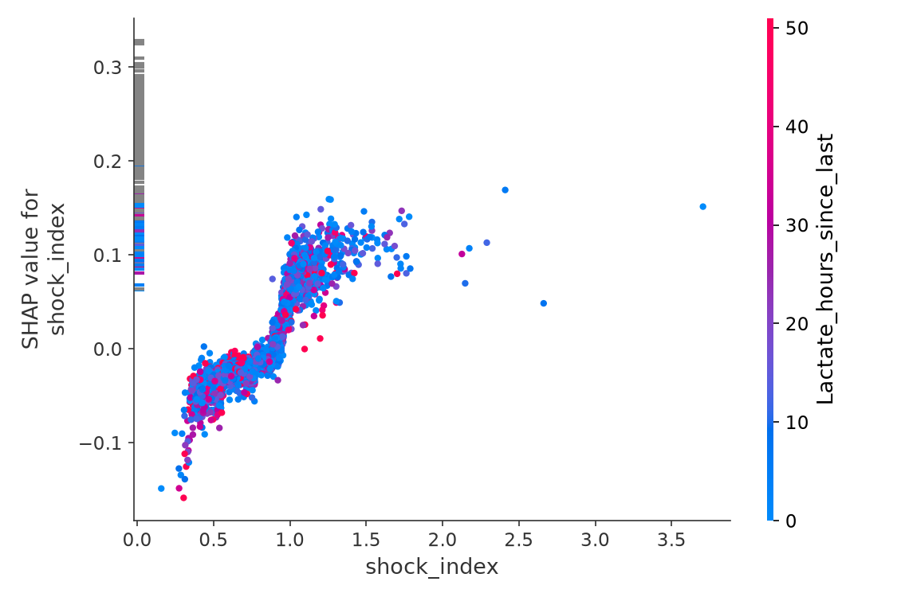

#### Partial SIRS score

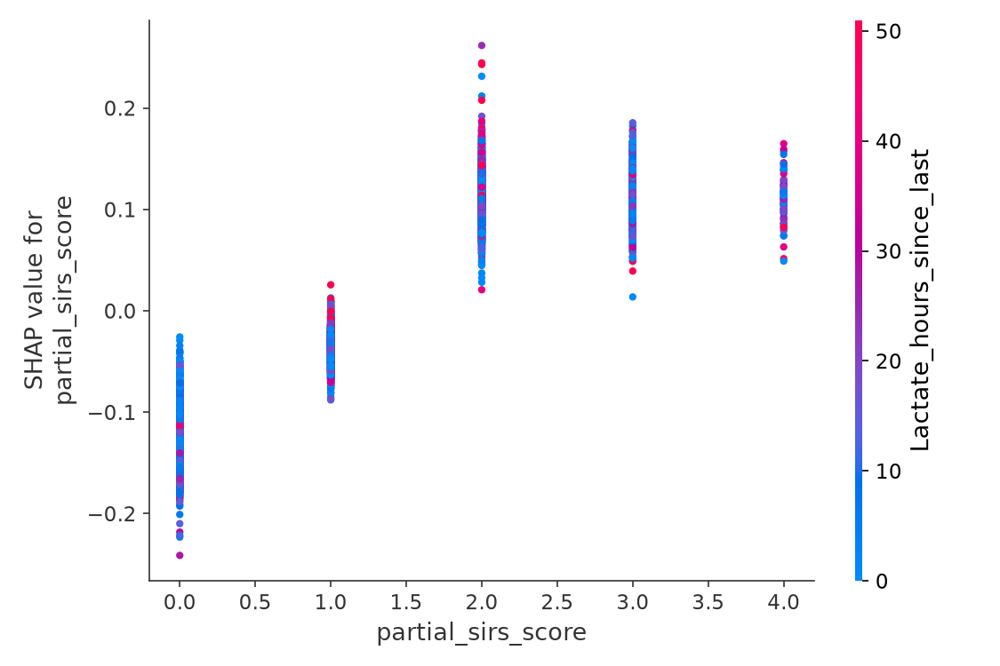

#### HR 6-hour slope

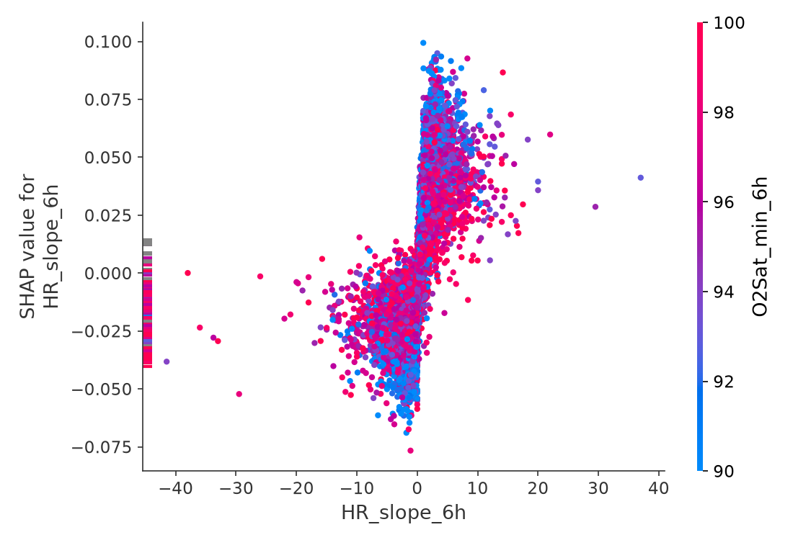

### Patient-level case explanation

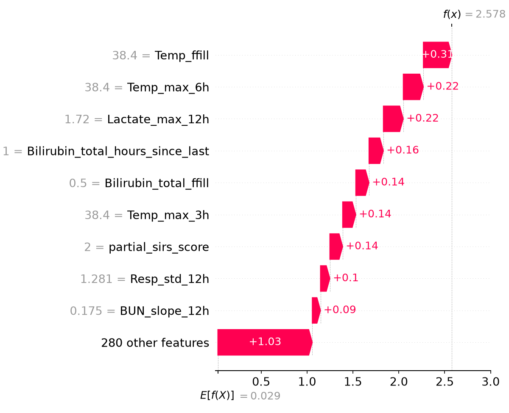

---

# 9. Early warning and alarm fatigue: `06_leadtime_alarm_fatigue.py`

This analysis asks:

> **How much warning does the system actually provide?**

Using the engineered model's operating threshold of **0.50**, the retained lead-time analysis reports:

- **2,932 septic patients**
- **87.6%** caught by at least one alert before or at the first positive label hour
- median lead time among caught patients: **22.0 hours**
- **68.6%** of caught patients warned at least **6 hours** ahead

### Alarm-fatigue comparison

At approximately matched sensitivity:

| Rule | Threshold | Sensitivity | Non-septic-hour false alarm rate |
|---|---:|---:|---:|
| Naive SIRS ≥2 | — | 0.5061 | **0.2890** |
| Engineered model, matched sensitivity | 0.5688 | 0.5072 | **0.1268** |
| Engineered model, operating point | 0.5000 | **0.5998** | 0.1796 |

At matched sensitivity, the engineered model's reported non-septic-hour false-alarm rate is therefore less than half the SIRS-style comparator's:

**0.1268 vs 0.2890.**

### Alarm episode analysis

The retained outputs now go beyond hourly alert counts and group consecutive alerts into alarm episodes.

| Model | Threshold | Alert hours | Alarm episodes | TP episodes | FP episodes | Septic patients with ≥1 TP episode | FP episodes / 1,000 patient-days |
|---|---:|---:|---:|---:|---:|---:|---:|
| Baseline | 0.5408 | 299,594 | 50,248 | 2,844 | 47,404 | 76.16% | 746.38 |
| **Engineered** | **0.5000** | **289,124** | **47,228** | **2,910** | **44,318** | **80.76%** | **697.79** |
| TabNet | 0.5817 | 279,441 | 59,752 | 3,003 | 56,749 | 78.44% | 893.51 |
| GRU-D | 0.5817 | 36,924 | 5,041 | 317 | 4,724 | 64.57% | 501.34 |
| Transformer | 0.6633 | 42,408 | 5,825 | 422 | 5,403 | 81.35% | 573.40 |

The engineered model reduces alert hours and alarm episodes relative to the raw baseline while increasing the number of septic patients with at least one true-positive episode.

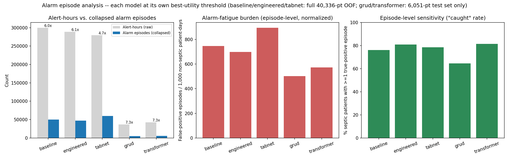

### Important interpretation of “22 hours”

The 22-hour median is **not** a claim that the model has been clinically proven to predict sepsis 22 hours before diagnosis.

It is the median difference between the first model alert and the first `SepsisLabel == 1` hour among caught patients. The label construction and retrospective nature of the dataset therefore matter.

---

# 10. Classical model comparison: `10_classical_classifiers.py`

The repository also evaluates simpler classifiers using the same raw-versus-engineered framing.

| Model | AUROC | AUPRC | Utility | Features |
|---|---:|---:|---:|---:|
| Decision Tree — engineered | 0.7152 | 0.0540 | 0.2065 | 289 |
| Naive Bayes — engineered | 0.7093 | 0.0387 | 0.1431 | 289 |
| Decision Tree — raw | 0.7056 | 0.0476 | 0.1793 | 15 |
| Naive Bayes — raw | 0.6957 | 0.0367 | 0.1410 | 15 |

This reinforces two points:

1. the engineered representation is useful across model families;
2. XGBoost is considerably stronger than these simpler classical baselines on this task.

---

# 11. Deep learning phase

Phase 6 asks:

> **Can sequence models learn the temporal and missingness structure more effectively than the engineered tree model?**

The three deep-learning challengers are deliberately not identical in input representation.

### GRU-D

GRU-D receives the raw 34 variables and explicitly models missingness through learned decay terms.

### TabNet

TabNet receives the engineered 289-feature table, making it a direct architectural competitor to engineered XGBoost.

### Transformer

The causal Transformer receives the raw 34 variables plus:

- observation masks;
- causal time-since-observation deltas;
- positional information.

A causal attention mask ensures that an hour cannot attend to future hours.

---

# 12. GRU-D: `16_grud_model_kaggle.py`

The current retained GRU-D run uses the **full 40,336-patient population**, rather than the earlier 20,000-patient laptop-RAM workaround.

### Split

- **28,235 train patients**
- **6,050 validation patients**
- **6,051 test patients**
- patient-level 70/15/15 split
- stratified on ever-septic status
- 34 raw variables
- maximum sequence length 336 hours
- hidden size 64
- early stopping on validation AUPRC

### Result

| Metric | GRU-D |
|---|---:|
| AUROC | **0.7387** |
| AUPRC | **0.0591** |
| Utility | **0.2374** |
| Validation-locked threshold | **0.6225** |
| Features | 34 |
| Train patients | 28,235 |
| Validation patients | 6,050 |
| Test patients | 6,051 |
| Epochs | 13 |

The threshold was selected on validation data and then applied once to the untouched test set. The test utility at the locked threshold is **0.2374**.

### Learned decay interpretation

Lower `gamma_x` means faster learned decay of stale information.

The current learned-decay ranking differs sharply from the hand-engineered SHAP ranking:

- Lactate is only **27/34** by fastest learned decay;
- Bilirubin_total is **23/34** by fastest learned decay;
- yet `Lactate_hours_since_last` and `Bilirubin_total_hours_since_last` rank **#3** and **#6** in the XGBoost SHAP ranking.

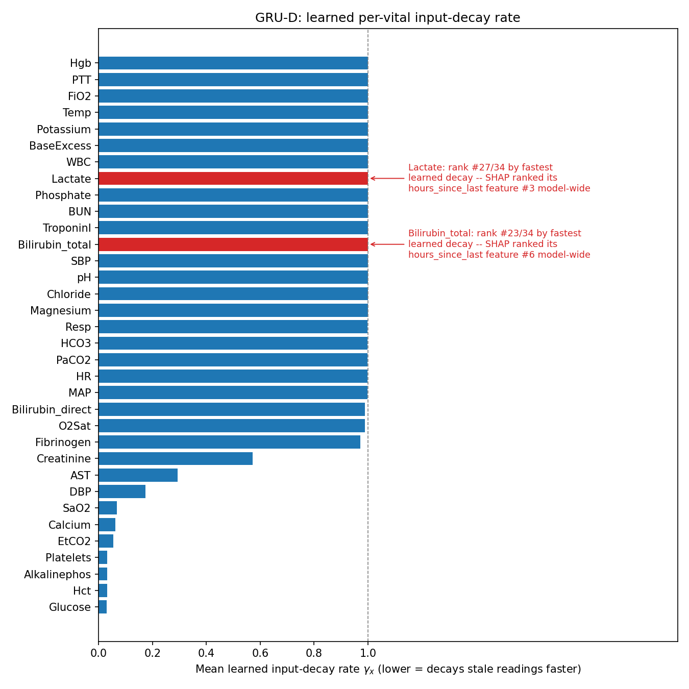

This is scientifically useful rather than a failure: the engineered XGBoost and GRU-D extract temporal missingness information in different ways.

---

# 13. TabNet: `17_tabnet_model_kaggle.py`

The current TabNet run is the full-population 5-fold OOF experiment.

### Result

| Metric | TabNet |
|---|---:|
| AUROC | **0.7597** |
| AUPRC | **0.0640** |
| Utility | **0.2687** |
| Features | 289 |

Relative to the current engineered XGBoost:

- XGBoost AUROC = **0.7926**
- TabNet AUROC = **0.7597**
- absolute gap ≈ **0.0329 AUROC**

### TabNet feature importance

The top current TabNet features are:

| Rank | Feature | Importance |
|---:|---|---:|
| 1 | `Lactate_hours_since_last` | 0.1766 |
| 2 | `Temp_mean_6h` | 0.0909 |
| 3 | `BUN_velocity_1h` | 0.0858 |
| 4 | `Bilirubin_total_hours_since_last` | 0.0657 |
| 5 | `Resp_mean_12h` | 0.0643 |
| 6 | `HR_mean_3h` | 0.0359 |
| 7 | `Platelets_hours_since_last` | 0.0301 |
| 8 | `Creatinine_std_12h` | 0.0293 |
| 9 | `MAP_min_3h` | 0.0284 |
| 10 | `Temp_max_3h` | 0.0188 |
| 11 | `BUN_max_3h` | 0.0188 |
| 12 | `Resp_mean_3h` | 0.0183 |
| 13 | `Lactate_std_12h` | 0.0177 |
| 14 | `WBC_std_3h` | 0.0150 |
| 15 | `WBC_ffill` | 0.0148 |

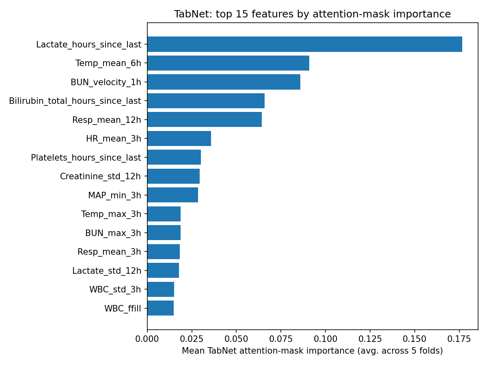

The current run's paired OOF comparison reports an AUROC difference between engineered XGBoost and TabNet of **0.0329**, with z ≈ **31.07** and p reported as 0 at machine precision.

---

# 14. Causal Transformer: `18_transformer_model_kaggle.py`

The current Transformer run is also a **full-population** experiment.

### Architecture

- 34 raw physiological variables
- value + mask + delta input channels
- input projection to 64 dimensions
- sinusoidal positional encoding
- 2 Transformer encoder layers
- 4 attention heads
- feed-forward dimension 128
- dropout 0.2
- causal attention mask
- **73,601 trainable parameters**
- maximum sequence length 336 hours

### Patient-level split

- **28,235 train**
- **6,050 validation**
- **6,051 test**
- 70/15/15 patient-level split
- stratified on ever-septic status

This replaces the older 20,000-patient Transformer experiment documented in the previous README.

### Current result

| Metric | Transformer |
|---|---:|
| **AUROC** | **0.8095** |
| **AUPRC** | **0.0984** |
| **Utility** | **0.3597** |
| Validation-locked threshold | **0.7042** |
| Parameters | 73,601 |
| Features | 34 |
| Test patients | 6,051 |
| Epochs | 8 |

The threshold was selected on the validation split and then applied once to the untouched test split. Validation utility at the selected threshold was **0.3938**; test utility was **0.3597**.

### Attention behavior

The mean attention analysis shows strong recency bias.

| Lag | Mean attention weight |
|---:|---:|
| 0 h | **0.1104** |
| 1 h | 0.0825 |
| 2 h | 0.0711 |
| 3 h | 0.0640 |
| 4 h | 0.0574 |
| 5 h | 0.0518 |
| 6 h | 0.0472 |
| 7 h | 0.0437 |
| 8 h | 0.0412 |
| 9 h | 0.0394 |
| 10 h | 0.0374 |
| 11 h | 0.0351 |

The most-attended lag is **0 hours**, meaning the learned representation is strongly recency-biased while still being able to attend to earlier history.

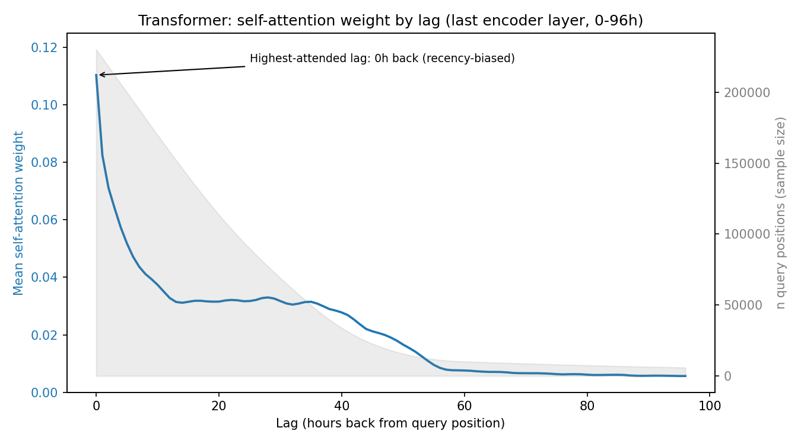

### Occlusion analysis

A new retained analysis masks the trailing `N` hours before each patient's reference point.

| Occlusion window | Mean |Δp|, septic | AUROC after occlusion | Septic alarm rate after occlusion |
|---:|---:|---:|---:|---:|
| 1 h | 0.0553 | 0.7536 | 0.3893 |
| 2 h | 0.0663 | 0.7505 | 0.3706 |
| 3 h | 0.0727 | 0.7476 | 0.3706 |
| 6 h | 0.0946 | 0.7379 | 0.3333 |
| 12 h | 0.1304 | 0.7186 | 0.3007 |
| 24 h | 0.1580 | 0.7026 | 0.2821 |
| 48 h | 0.1795 | 0.7290 | 0.2774 |

The effect grows as recent history is removed: masking the trailing 24 hours changes septic-patient probabilities by an average of **0.1580** and reduces reference-point AUROC from **0.7618 to 0.7026**.

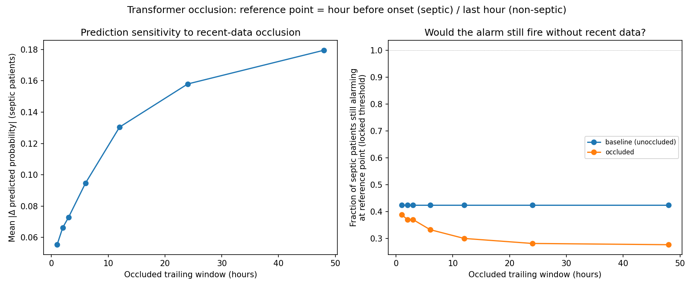

---

# 15. How to read the model leaderboard correctly

The current deep-learning runs are **not** the same experiment as the main XGBoost OOF evaluation.

### XGBoost / classical models

- full population;
- patient-grouped 5-fold OOF evaluation;
- 40,336 patients;
- approximately 1.55M hourly predictions.

### GRU-D / Transformer

- full 40,336-patient cohort;
- patient-level 70/15/15 split;
- 28,235 train / 6,050 validation / 6,051 test;
- early stopping;
- same held-out test patients for the two current sequence-model experiments.

### TabNet

- full-population 5-fold OOF;
- same engineered 289-feature table as XGBoost.

Therefore the most defensible statements are:

1. **Engineered XGBoost clearly improves over its raw-snapshot baseline.**
2. **Engineered XGBoost is stronger than TabNet and the current GRU-D run under their reported OOF/test protocols.**
3. **The current causal Transformer is the strongest reported deep-learning model.**
4. **The Transformer test result should not be compared to the full-population XGBoost OOF number as if they were identical evaluation populations.**
5. **The old README's 20,000-patient Transformer/GRU-D numbers are superseded by the current full-population runs.**

---

# 16. Cross-hospital generalization: `14_cross_hospital_generalization.py`

A major question for clinical ML is whether a model trained in one institution transfers to another.

| Train → Test | AUROC | AUPRC | Utility | AUROC drop |
|---|---:|---:|---:|---:|
| Hospital 1 → Hospital 2 | 0.7381 | 0.0545 | 0.1931 | 0.0538 |
| Hospital 2 → Hospital 1 | 0.7226 | 0.0609 | 0.2439 | 0.0693 |
| In-distribution reference | 0.7918 | 0.0821 | 0.3203 | — |

The degradation is substantial.

This is one of the most important results in the project because it prevents overclaiming. A model can look strong under pooled cross-validation and still lose performance when moved between hospital systems.

The implication is not that the model is unusable. It is that **external/site-specific validation is essential before deployment**.

---

# 17. Fairness audit: `13_fairness_audit.py`

The fairness analysis evaluates the engineered model without retraining separate models for each subgroup.

### AUROC gaps

| Axis | Highest group | Highest AUROC | Lowest group | Lowest AUROC | Gap |
|---|---|---:|---|---:|---:|
| Hospital | hospital_system_2 | 0.8084 | hospital_system_1 | 0.7718 | **0.0366** |
| Age | 60–74 | 0.8015 | 75+ | 0.7811 | **0.0204** |
| Gender | Female | 0.7920 | Male | 0.7915 | **0.0005** |

Gender performance is extremely close in AUROC. Age differences are small but non-zero. The largest measured gap is across hospital systems, reinforcing the cross-hospital generalization result.

These are performance audits, not claims of complete fairness. The available demographic variables and retrospective dataset cannot establish fairness across every clinically relevant population.

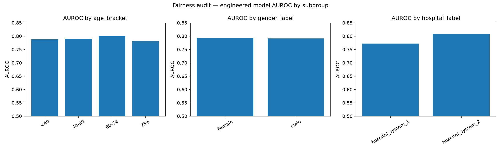

---

# 18. Conformal uncertainty: `15_conformal_prediction.py`

The conformal analysis asks:

> When should the system make a confident statement, and when should it admit uncertainty?

At a nominal confidence level of **90%**:

| Measure | Result |
|---|---:|
| Empirical coverage | **89.74%** |
| Confident no-sepsis | 72.94% |
| Confident sepsis | 10.51% |
| Uncertain / both labels | 16.56% |
| Empty sets | 0% |
| Accuracy, confident hours | 87.71% |
| Accuracy, uncertain hours | 57.52% |
| Utility, full cohort | 0.3217 |
| Utility, confident-only | **0.3871** |

The confident-only utility being higher is suggestive of a useful selective-prediction strategy: the model's strongest predictions are more operationally useful than forcing a hard answer on every hour.

Coverage remains distribution-dependent and should not be interpreted as a universal guarantee after deployment in a new hospital.

---

# 19. Association rules: `08_association_rules.py`

The association-rule analysis converts selected physiological variables into abnormality flags and mines co-occurrence patterns using Apriori.

The run contains:

- **1,552,210 patient-hour rows**
- **374 rules overall**
- **28 rules with Sepsis as the consequent**

The strongest reported sepsis-consequent rule is:

```text
Resp_high + Temp_abnormal → Sepsis
```

with:

- support = 0.00206
- confidence = 0.0509
- lift = **2.83**

Another strong rule is:

```text
HR_high + Temp_abnormal → Sepsis
```

with lift ≈ **2.82**.

### Important warning

Association rules are **descriptive**, not causal.

A lift above 1 means the combination occurs with the target more often than expected under the rule's baseline independence reference. It does not establish that one physiological abnormality causes sepsis or that the rule should be used as a clinical decision rule.

---

# 20. Clustering and phenotype discovery

The repository investigates whether patient trajectories naturally form distinct phenotypes.

## Hierarchical clustering

Ward hierarchical clustering uses an intentional **8,000-patient stratified sample**.

Reported silhouette:

- hierarchical Ward: **0.0949**
- matched K-means: **0.1565**
- full complete-case K-means: **0.1603**

The relatively low hierarchical silhouette indicates that the discovered clusters are not sharply separated in the chosen representation.


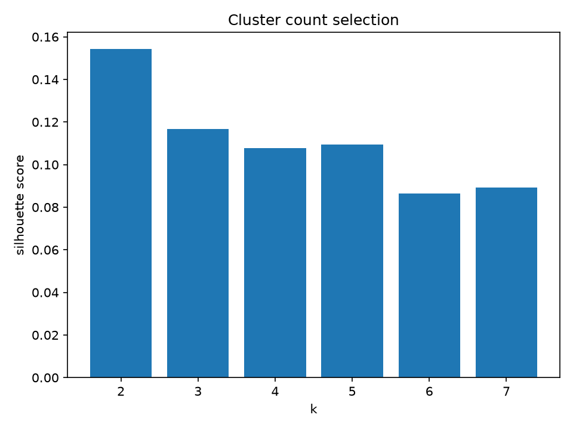

The project should therefore treat these clusters as **exploratory phenotype structure**, not clinically established patient subtypes.

## DBSCAN

The DBSCAN run uses:

- 32,465 patients
- epsilon ≈ 3.5512
- minimum samples = 10
- 1 dominant cluster
- 662 noise points
- 2.04% noise


The DBSCAN noise group has a higher observed sepsis rate than the dominant cluster. This suggests that some physiologically unusual patients may occupy a sparse region of feature space, but this remains an exploratory association rather than a diagnostic classifier.

---

# 21. Outlier analysis: `12_outlier_analysis.py`

The project compares IQR-based physiological outlier flags with Isolation Forest.

| Method | % flagged | Sepsis-rate lift |
|---|---:|---:|
| IQR Temp | 1.54% | **3.86×** |
| IQR 2+ vitals | 1.21% | **3.27×** |
| Isolation Forest | 2.00% | **3.21×** |
| IQR Resp | 3.78% | 2.51× |
| IQR HR | 1.12% | 2.46× |
| IQR WBC | 2.63% | 2.33× |
| IQR any vital | 10.96% | 2.30× |
| IQR Lactate | 2.14% | 1.86× |
| IQR SBP | 1.14% | 1.20× |

Temperature outliers have the largest reported sepsis-rate lift.

Again, an outlier is not synonymous with sepsis. The analysis asks whether unusual observations are enriched for the target, not whether they diagnose it.


---

# 22. OLAP and Power BI layer: `07_olap_and_export.py`

The project is not only a machine-learning experiment. It also demonstrates an analytical warehouse workflow.

The OLAP stage demonstrates:

- hourly → daily roll-up;
- daily → stay roll-up;
- hospital → patient → hour drill-down;
- septic slice;
- combined hospital/sepsis/lactate dice.

Reported outputs include:

- **105,665** daily roll-up rows;
- **40,336** stay-level rows;
- **27,916** rows in the septic slice;
- **2,438** rows in the example hospital + septic + lactate > 2 dice;
- Power BI fact export with **1,552,210 rows × 15 columns**.

The exported tables are designed to support downstream dashboards without making the dashboard layer responsible for rebuilding the clinical feature-engineering pipeline.

See `POWERBI_HANDOFF.md` for the dashboard-side workflow.

---

# 23. Statistical evaluation methodology

## AUROC

AUROC measures ranking ability across thresholds. It is useful for comparing discrimination but can look deceptively reassuring in severely imbalanced problems.

## AUPRC

AUPRC is emphasized because the positive class is rare. It focuses attention on precision-recall behavior for the clinically important minority class.

## Normalized utility

`utility_score.py` implements a vectorized version of the official PhysioNet/CinC 2019 utility framework.

The configured timing parameters are:

```text
dt_early   = -12 hours
dt_optimal = -6 hours
dt_late    = +3 hours
```

with:

```text
max_u_tp = +1
min_u_fn = -2
u_fp     = -0.05
u_tn     = 0
```

The normalized score is scaled so that:

- a best-possible prediction sequence is 1;
- doing nothing is 0;
- a model can score below 0 if it is worse than inaction.

The implementation evaluates each patient's chronological sequence rather than treating rows as independent classification events.

## DeLong's test

`delong.py` implements the fast DeLong method for comparing correlated ROC AUCs. It is appropriate when two models produce predictions for the same held-out rows.

Where paired predictions are available, this is preferable to simply subtracting independently estimated AUROCs.

---

# 24. Leakage and temporal discipline

Leakage prevention is one of the strongest parts of the pipeline design.

### Patient-level grouping

For the XGBoost and classical models, `GroupKFold` uses `patient_id`. This prevents different hours from the same patient appearing in both training and validation folds.

### Causal windows

The temporal feature engine only uses observations available at or before the prediction hour.

### Training-only normalization

The Transformer standardizes variables using training-set statistics and uses the training mean for imputation after standardization.

### Patient-level deep-learning split

GRU-D and Transformer split patients rather than hourly rows into train/validation/test groups.

The current full-population sequence split is:

- train: **28,235 patients**
- validation: **6,050 patients**
- test: **6,051 patients**

### Calibration split discipline

The new recalibration stage adds another separation rule:

- OOF models: a deterministic **70/30 patient-level calibration fit/evaluation split**;
- sequence models: calibration is fit on the **validation set** and evaluated on the untouched **test set**.

The calibration script explicitly avoids fitting Platt scaling on the same rows used to evaluate the calibrated probabilities.

### What is still important to validate

No retrospective pipeline can completely remove all sources of dataset-construction bias. The `SepsisLabel` target is generated according to the Challenge's labeling process, and clinical workflow can influence what measurements are available.

Therefore, repository claims should remain about **benchmark performance on this dataset**, not prospective clinical efficacy.

---

# 25. Calibration and post-hoc probability correction: `19_recalibration.py`

This is the major new analysis added after the earlier README.

The pre-recalibration diagnostics showed that raw probabilities were badly calibrated. For example, on held-out evaluation data:

| Model | Raw Brier | Raw calibration intercept | Raw calibration slope |
|---|---:|---:|---:|
| Baseline | 0.1606 | -3.748 | 0.940 |
| Engineered XGBoost | 0.1365 | -3.635 | 1.009 |
| TabNet | 0.1694 | -3.823 | 0.823 |
| GRU-D | 0.1977 | -3.966 | 1.186 |
| Transformer | 0.1879 | -4.061 | 0.820 |

The raw Brier scores are far above the no-skill Brier of roughly **0.0174–0.0177**, showing severe probability miscalibration despite useful ranking performance.

## Method

`19_recalibration.py` applies **Platt scaling**:

```text
logit(p_calibrated) = a * logit(p_raw) + b
```

The calibrator is fitted only on a disjoint patient-level fit split and then applied to the held-out evaluation split.

This preserves ranking because Platt scaling is monotonic, so AUROC should remain unchanged.

## Before vs. after calibration

| Model | Brier raw | Brier calibrated | Intercept raw | Intercept calibrated | Slope raw | Slope calibrated | AUROC |
|---|---:|---:|---:|---:|---:|---:|---:|
| Baseline | 0.1606 | **0.0173** | -3.748 | -0.012 | 0.940 | 0.987 | 0.7525 |
| Engineered | 0.1365 | **0.0171** | -3.635 | 0.057 | 1.009 | 1.005 | 0.7919 |
| TabNet | 0.1694 | **0.0173** | -3.823 | 0.045 | 0.823 | 1.004 | 0.7571 |
| GRU-D | 0.1977 | **0.0171** | -3.966 | -0.431 | 1.186 | 0.867 | 0.7387 |
| Transformer | 0.1879 | **0.0167** | -4.061 | -0.178 | 0.820 | 0.920 | 0.8095 |

The result is clear:

- calibration substantially improves Brier score;
- calibration intercepts move much closer to 0;
- calibration slopes move closer to 1;
- AUROC is unchanged, as expected for a monotonic probability transformation.

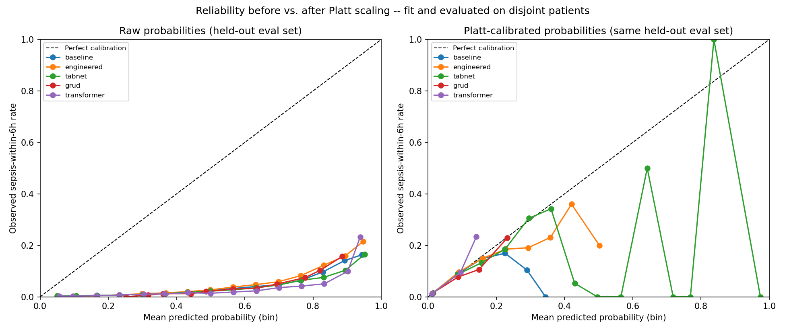

## Threshold re-lock

Calibration changes the numerical scale of the probabilities, so the old raw thresholds cannot simply be reused.

Thresholds were therefore re-selected on the calibration-fit/validation side and locked before evaluation.

| Model | Raw threshold | Eval utility at raw threshold | Calibrated threshold | Eval utility at calibrated threshold |
|---|---:|---:|---:|---:|
| Baseline | 0.5408 | 0.2432 | **0.0508** | 0.1682 |
| Engineered | 0.5000 | 0.3200 | **0.0508** | 0.2479 |
| TabNet | 0.5817 | 0.2641 | **0.0508** | 0.1857 |
| GRU-D | 0.6225 | 0.2374 | **0.0508** | 0.1946 |
| Transformer | 0.7042 | 0.3597 | **0.0508** | 0.3037 |

This produces an important methodological result:

> **Better probability calibration does not automatically mean higher PhysioNet utility at the same operating policy.**

The calibrated probabilities are much more statistically faithful, but utility is threshold- and workflow-dependent. A deployment-oriented system would need to optimize the operating point after calibration under an explicit alert-rate/workflow constraint rather than assuming that the threshold maximizing retrospective utility on raw scores remains appropriate.

The retained `calibration_split_manifest.csv` documents the patient IDs used for calibration-fit versus calibration-evaluation splits.

---

# 26. The central scientific story

The project can be summarized as a sequence of increasingly demanding questions.

### Question 1 — Are raw physiological snapshots enough?

**Answer:** useful, but limited.

Raw XGBoost reaches **0.7572 AUROC**.

### Question 2 — Does temporal context matter?

**Answer:** yes.

Adding rolling statistics, trends, missingness, and clinical composites raises XGBoost to **0.7926 AUROC** and **0.0834 AUPRC**.

### Question 3 — Which temporal representation matters most?

**Answer:** rolling statistics are the strongest single family.

### Question 4 — Does the model use clinically meaningful information?

**Answer:** the SHAP results show strong contributions from lactate, SIRS-like state, temperature, respiratory behavior, bilirubin, BUN, potassium, shock index, and measurement-recency features.

### Question 5 — Does this translate into earlier warning?

**Answer:** in the retrospective label-based analysis, **87.6%** of septic patients were caught before or at the first positive label, with a **22-hour median label-based lead time** among caught patients.

### Question 6 — Can it reduce alarm burden?

**Answer:** at matched sensitivity, the engineered model has a substantially lower reported non-septic-hour false-alarm rate than the naive SIRS comparator.

### Question 7 — Does it generalize between hospitals?

**Answer:** only partially. AUROC drops by about **0.054–0.069** in the two cross-hospital directions.

### Question 8 — Is performance uniform across groups?

**Answer:** gender performance is almost identical; age differences are modest; hospital differences are larger.

### Question 9 — Does uncertainty information help?

**Answer:** conformal prediction identifies an uncertain subset, and the confident-only subset has higher reported utility.

### Question 10 — Can deep sequence models beat the tree?

**Answer:** the current GRU-D does not beat engineered XGBoost, while the current causal Transformer reaches **0.8095 AUROC / 0.0984 AUPRC / 0.3597 utility** on its 6,051-patient held-out test set.

### Question 11 — Are the model outputs calibrated?

**Answer:** not before recalibration. Raw probabilities are substantially overconfident, but held-out Platt scaling reduces Brier scores to approximately **0.0167–0.0173** while preserving AUROC.

### Question 12 — Does calibration solve threshold selection?

**Answer:** no. Calibration changes the probability scale and therefore requires a new operating threshold. In this run, the calibrated threshold was approximately **0.0508**, and the resulting held-out utility was lower than the old raw-threshold utility for every evaluated model. This shows why calibration and operational thresholding should be treated as separate decisions.

---

# 27. Main strengths

1. **End-to-end architecture:** data warehouse → features → models → evaluation → interpretability → calibration → deployment-oriented analyses.
2. **Patient-grouped evaluation:** avoids the most obvious repeated-measures leakage failure.
3. **Causal temporal features:** rolling windows do not look forward.
4. **Multiple metrics:** AUROC, AUPRC and a clinical utility metric are all reported.
5. **Statistical model comparison:** paired DeLong testing is used where predictions are directly comparable.
6. **Interpretability:** SHAP connects model performance to specific variables and temporal patterns.
7. **Early-warning analysis:** the project measures lead time rather than stopping at discrimination.
8. **Alarm-fatigue analysis:** compares false-alarm burden with a simple SIRS-style rule.
9. **Alarm-episode analysis:** groups repeated alerts into episodes and reports episode-level burden.
10. **External-site stress test:** cross-hospital validation exposes meaningful distribution shift.
11. **Fairness audit:** age, gender and hospital subgroup performance are explicitly measured.
12. **Uncertainty analysis:** conformal prediction adds selective-confidence information.
13. **Probability calibration:** Platt scaling corrects severe raw probability miscalibration using disjoint patient splits.
14. **Model diversity:** tree, classical, TabNet, recurrent and Transformer architectures are compared.
15. **Transformer temporal analysis:** attention-by-lag and trailing-window occlusion provide complementary temporal diagnostics.
16. **Analytical warehouse layer:** OLAP and Power BI exports connect ML to practical analytics workflows.

---

# 28. Limitations and what should happen next

### 1. Retrospective benchmark

The project is evaluated on historical ICU data. Prospective workflow validation is still required.

### 2. Target-definition dependence

All predictive and lead-time results depend on the Challenge's `SepsisLabel` construction. A real deployment would need a carefully specified clinical target and prospective endpoint.

### 3. Cross-hospital degradation

The cross-hospital experiments show meaningful performance loss. This is the clearest evidence that external validation is necessary.

### 4. Class imbalance

Sepsis is rare at the patient-hour level. AUPRC and utility should therefore remain central when interpreting performance.

### 5. Repeated hourly observations

Hourly rows from a patient are temporally correlated. Patient grouping prevents direct patient leakage, but it does not make the observations statistically independent.

### 6. Deep-learning evaluation is not identical to XGBoost evaluation

The current deep-learning models use a 70/15/15 patient split, whereas the main XGBoost and TabNet experiments use full-population OOF evaluation. The README keeps these protocols separate.

### 7. Clustering is exploratory

The low silhouette values indicate weakly separated phenotypes. These clusters should not be interpreted as validated clinical subtypes.

### 8. Association rules are not causal

High lift indicates association, not intervention effect or mechanism.

### 9. Fairness scope is limited by available variables

The audit covers the demographic/site variables represented in the data. It is not a complete fairness certification.

### 10. Calibration is dataset-dependent

Platt scaling substantially improves held-out calibration in this benchmark, but calibration can drift under prevalence shift, hospital shift, workflow change, or temporal shift.

### 11. Calibration does not determine the operational threshold

A calibrated probability is not automatically an optimal alarm policy. Thresholds must be selected under the intended utility, alert-rate, and workflow constraints.

### 12. Transformer result needs external validation

The Transformer result is promising, but one held-out patient split is not enough to establish clinical superiority. Replication across temporal splits, institutions, and external datasets is required.

---

# 29. Recommended next research steps

The most useful next steps, in order, are:

1. **External validation on another ICU dataset.**
2. **Temporal holdout validation** rather than only patient-level random splits.
3. **Repeated seeds / repeated patient splits** for the deep models.
4. **Hospital-specific calibration** and threshold analysis.
5. **Calibration under distribution shift** and prevalence shift.
6. **Patient-level sensitivity and specificity at operational alert rates.**
7. **Time-dependent precision/recall and lead-time distributions**, not only median lead time.
8. **Decision-curve analysis / net benefit.**
9. **Prospective-style alarm simulation**, including repeated-alert suppression and cooldown periods.
10. **Transformer ablations:** values only vs values + mask vs values + mask + delta.
11. **Transformer attention stability across seeds and patients.**
12. **Ablation of missingness alone versus value + missingness jointly.**
13. **More rigorous uncertainty evaluation under distribution shift.**
14. **Calibration-aware threshold optimization** with explicit alert-frequency constraints.

---

# 30. Reproducibility

The intended execution order is approximately:

```bash
python src/01_etl_warehouse.py
python src/02_feature_engineering.py
python src/03_baseline_model.py
python src/04_engineered_model_kaggle.py
python src/05_explainability.py
python src/06_leadtime_alarm_fatigue.py
python src/07_olap_and_export.py
python src/08_association_rules.py
python src/09_hierarchical_clustering.py
python src/10_classical_classifiers.py
python src/11_dbscan_clustering.py
python src/12_outlier_analysis.py
python src/13_fairness_audit.py
python src/14_cross_hospital_generalization.py
python src/15_conformal_prediction.py
python src/16_grud_model_kaggle.py
python src/17_tabnet_model_kaggle.py
python src/18_transformer_model_kaggle.py
python src/19_recalibration.py
```

The deep-learning scripts require PyTorch in addition to the core scientific Python stack.

The generated `outputs/` directory is retained so that results can be inspected without retraining every model.

### Current deep-learning run note

The retained GRU-D and Transformer logs show:

- full population: **40,336 patients**
- train: **28,235**
- validation: **6,050**
- test: **6,051**
- stratification on ever-septic status
- patient-level rather than hourly splitting.

The older README's 20,000-patient deep-learning description is therefore no longer the current execution contract.

---

# 31. Figures and generated evidence

The current outputs contain the following generated figures.

### Explainability


### Unsupervised analysis


### Fairness and deep learning


### Calibration and alarm analysis


The earlier raw calibration diagnostic is also retained:

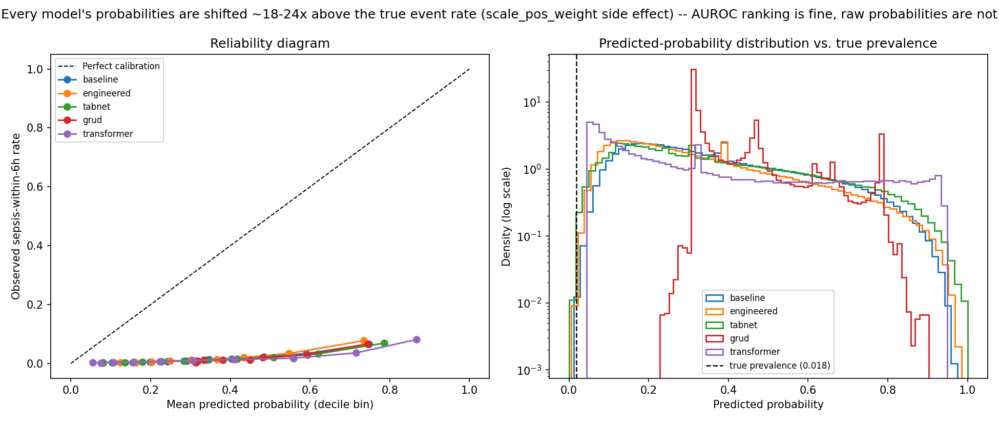

These figures are generated from the retained `outputs/` artifacts and are intended to make the README function as a compact visual research report.

---

# 32. Bottom line

This is a substantial research prototype, not merely a model-training script.

The strongest parts are:

- causal temporal feature engineering;
- patient-level evaluation discipline;
- explicit feature-family ablations;
- clinical-utility scoring;
- early-warning analysis;
- alarm episode analysis;
- cross-hospital stress testing;
- SHAP analysis;
- full-population deep-learning challengers;
- Transformer temporal diagnostics;
- and the newly added calibration/threshold analysis.

The current results tell a coherent story:

> **Temporal context matters. Measurement timing matters. Rolling physiological behavior is more informative than a single snapshot. The engineered XGBoost model is a strong tabular baseline. Cross-hospital transfer is a real weakness. The current causal Transformer is the strongest reported deep-learning model. And raw model probabilities are substantially miscalibrated, making post-hoc calibration and threshold re-locking necessary before interpreting model scores as probabilities or designing an operational alarm policy.**

The most important caveat is equally clear:

> **These results demonstrate predictive performance on the PhysioNet 2019 benchmark; they do not by themselves establish prospective clinical effectiveness.**

---

## References

- PhysioNet / Computing in Cardiology Challenge 2019 dataset and evaluation framework.
- Che et al., *Recurrent Neural Networks for Multivariate Time Series with Missing Values*, Scientific Reports (GRU-D).
- Vaswani et al., *Attention Is All You Need* (Transformer architecture).
- Sun & Xu, *Fast Implementation of DeLong's Algorithm for Comparing the Areas Under Correlated Receiver Operating Characteristic Curves*.
- Platt, *Probabilistic Outputs for Support Vector Machines and Comparisons to Regularized Likelihood Methods* (Platt scaling).

## License / data note

The repository does not redistribute the underlying clinical dataset. Users should obtain the PhysioNet Challenge 2019 data through its official distribution and comply with the dataset's applicable terms.
