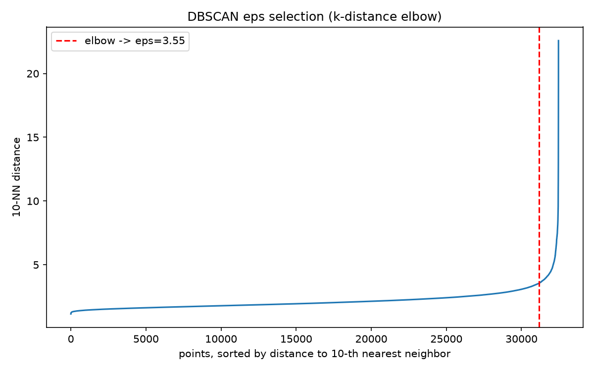
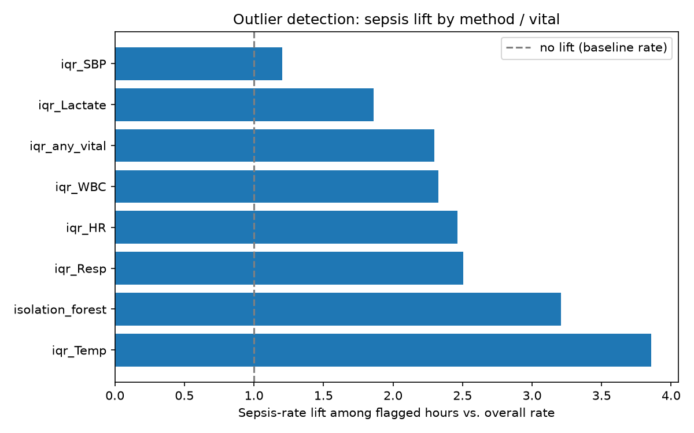

# Early Warning System for Sepsis Onset Using Dynamic Physiological Telemetry

A capstone project predicting sepsis onset **6 hours ahead** from hourly ICU vitals and labs, built on the real **PhysioNet/CinC Challenge 2019** dataset. Built for the "Data Warehouse and Mining" (DWM) and "Feature Engineering" (FE) subjects, B.Tech AI & Data Science, Sem V.

> **Note on the title:** this is deliberately named *"...Sepsis Onset..."* and not the broader *"...Patient Deterioration..."* used in the original course proposal, because that is what `SepsisLabel` — the actual target variable — measures. Calling it "deterioration" would overstate what the model is trained on.

---

## Table of contents

1. [Dataset](#1-dataset)
2. [Pipeline overview](#2-pipeline-overview)
3. [Script-by-script walkthrough](#3-script-by-script-walkthrough)
4. [Key engineering incident: the OOM crash](#4-key-engineering-incident-the-oom-crash)
5. [Leakage handling](#5-leakage-handling)
6. [Syllabus gap analysis](#6-syllabus-gap-analysis-why-scripts-07-12-exist)
7. [Results summary](#7-results-summary)
8. [Fairness, generalization & uncertainty quantification](#8-fairness-generalization--uncertainty-quantification-why-scripts-13-15-exist)
9. [Known limitations / honest caveats](#9-known-limitations--honest-caveats)
10. [Repository structure & how to reproduce](#10-repository-structure--how-to-reproduce)
11. [Pending work](#11-pending-work)

---

## 1. Dataset

The [PhysioNet/Computing in Cardiology Challenge 2019](https://physionet.org/content/challenge-2019/) dataset:

| | |
|---|---|
| Patients | 40,336 |
| Patient-hours | 1,552,210 |
| Positive (septic) hour rate | 1.8% |
| Raw features per hour | 40 vitals/labs + demographics (`HR`, `O2Sat`, `Temp`, `SBP`, `MAP`, `DBP`, `Resp`, `EtCO2`, `BaseExcess`, `HCO3`, `FiO2`, `pH`, `PaCO2`, `SaO2`, `AST`, `BUN`, `Alkalinephos`, `Calcium`, `Chloride`, `Creatinine`, `Bilirubin_direct`, `Glucose`, `Lactate`, `Magnesium`, `Phosphate`, `Potassium`, `Bilirubin_total`, `TroponinI`, `Hct`, `Hgb`, `PTT`, `WBC`, `Fibrinogen`, `Platelets`) |
| Target | `SepsisLabel`, defined via Sepsis-3 criteria, shifted to represent "sepsis within the next 6h" |
| Hospitals | 2 (`hospital_system_1`, `hospital_system_2`) |

This is a genuinely hard, severely imbalanced clinical prediction task — 1.8% positive rate means a model that always predicts "no sepsis" is already 98.2% accurate, which is exactly why AUROC/AUPRC, not accuracy, are used to judge it throughout this project.

---

## 2. Pipeline overview

Scripts live in `src/` and are numbered in execution order:

```
01_etl_warehouse.py           raw .psv  ->  DuckDB star schema
02_feature_engineering.py     star schema  ->  294-column engineered feature table
03_baseline_model.py          XGBoost on 15 raw features (control)
04_engineered_model.py        XGBoost on full engineered feature set + DeLong test + ablation
05_explainability.py          SHAP analysis on the engineered model
06_leadtime_alarm_fatigue.py  clinical framing: lead time, sensitivity, false-alarm rate
07_olap_and_export.py         OLAP demo (roll-up/drill-down/slice/dice) + Power BI export
08_association_rules.py       Apriori / association rule mining on binned abnormal-flags
09_hierarchical_clustering.py Ward-linkage hierarchical clustering (phenotype discovery)
10_classical_classifiers.py   Decision Tree + Naive Bayes classifiers (raw vs engineered features)
11_dbscan_clustering.py       DBSCAN density-based clustering (phenotype discovery, 3rd method)
12_outlier_analysis.py        IQR fencing + Isolation Forest outlier detection vs SepsisLabel
13_fairness_audit.py          subgroup AUROC/AUPRC/utility audit across age, gender, hospital
14_cross_hospital_generalization.py  train-on-one-hospital / test-on-the-other generalization test
15_conformal_prediction.py    MAPIE split-conformal classification with 90% coverage guarantee
clustering_phenotypes.py      k-means clustering (phenotype discovery)
delong.py                     DeLong's test helper (statistical comparison of two AUCs)
utility_score.py              PhysioNet Challenge 2019's official clinical utility metric
```

Everything downstream of `01_etl_warehouse.py` reads from the DuckDB warehouse, not the raw `.psv` files — this keeps every later step fast and lets DuckDB's vectorized SQL engine do the heavy lifting (window functions, aggregations) instead of pandas.

---

## 3. Script-by-script walkthrough

### `01_etl_warehouse.py` — raw files to star schema

**What it does:** parses the raw PhysioNet `.psv` (pipe-separated) files, one per patient, and loads them into a DuckDB warehouse using a classic **star schema**:

- `dim_patient` — one row per patient (age, gender, hospital, admission time, ICU length of stay, ever-septic flag)
- `dim_hospital` — one row per hospital system
- `fact_vitals_hourly` — one row per **patient-hour** (the grain of the whole project), with 33 raw vitals/labs columns, `ICULOS`, and `SepsisLabel`

**Why a star schema:** this is the DWM syllabus requirement — dimensional modeling with clearly separated fact and dimension tables — and it also happens to be the right structure for this data: vitals are naturally a fact table (one measurement event per patient per hour) with patient and hospital as dimensions you'd want to slice by.

### `02_feature_engineering.py` — SQL window-function features

**What it does:** runs SQL window-function queries directly in DuckDB (not pandas) to turn the 33 raw columns into **294 engineered columns**. Four feature families:

| Family | Count | Logic |
|---|---|---|
| `raw_ffill` | 15 | Forward-filled snapshot of the most recent reading per vital (labs aren't drawn every hour, so most cells in the raw table are `NULL`) |
| `rolling_stats` | 180 | Causal rolling mean / std / min / max / slope over **3h / 6h / 12h windows**, per vital |
| `slopes_velocity` | 60 | Rate-of-change features — is a vital moving in a dangerous direction, not just where it currently sits |
| `missingness` | 30 | `hours_since_last_<vital>` — how long since this vital was last measured |
| `clinical_ratios` | 4 | Domain-knowledge features: shock index (HR/SBP), pulse pressure (SBP−DBP), partial SIRS score, partial qSOFA score |

**Why "causal" windows matter:** every rolling/window feature only looks **backward** in time from the current hour — `AVG(HR) OVER (PARTITION BY patient_id ORDER BY hour ROWS BETWEEN 11 PRECEDING AND CURRENT ROW)` style logic, never `FOLLOWING`. This is the single most important anti-leakage decision in the whole project (see [§5](#5-leakage-handling)) — a model that could see future vitals would trivially "predict" sepsis it had already been told about.

**Why missingness-as-signal:** in ICU data, a lab *not* being drawn is itself informative — clinicians order more frequent labs (e.g., lactate) when they're worried about a patient. So `hours_since_last_Lactate` is a real predictive signal, not just an artifact of sparse data — and this is empirically confirmed later in the SHAP results (§3, `05_explainability.py`), where `Lactate_hours_since_last` and `Bilirubin_total_hours_since_last` rank in the top 6 most important features model-wide.

### `03_baseline_model.py` — the control group

**What it does:** trains XGBoost on **only the 15 raw forward-filled features** (no rolling stats, no engineered ratios), using `GroupKFold(5)` split **by patient** (not by row) — critical, since splitting by row would let hours from the same patient leak across train/test.

**Result:**

| Metric | Value |
|---|---|
| AUROC | **0.7572** |
| AUPRC | **0.0634** |
| Normalized utility | **0.2504** |
| Best threshold | 0.541 |
| Features | 15 |

This exists purely as a control — it answers "how much does the feature engineering actually buy us?" in §3 (`04_engineered_model.py`) below.

### `04_engineered_model.py` — the full model, with statistical proof it's actually better

**What it does:** trains XGBoost on the full 289-feature engineered set (of the 294 columns produced in script 02, 289 are used as model inputs — the rest are identifiers/labels not meant to be features), same `GroupKFold(5)` patient-level split, then runs two extra analyses:

1. **DeLong's test** — a statistical test specifically designed to tell whether two AUROCs, computed on the *same* patients, are significantly different (not just "one number is bigger than the other by chance").
2. **Feature-family ablation** — retrain the model using *only* one feature family at a time (plus demographics), to see which family is actually carrying the predictive lift.

**Result:**

| Metric | Baseline | Engineered |
|---|---|---|
| AUROC | 0.7572 | **0.7918** |
| AUPRC | 0.0634 | **0.0821** |
| Normalized utility | 0.2504 | **0.3203** |
| Features | 15 | 289 |

**DeLong's test:** z = **−38.30**, p ≈ **0.0** — the AUROC improvement is not noise; it's about as statistically decisive as this kind of test gets on 1.55M paired hourly predictions.

**Ablation — which feature family actually matters:**

| Feature family | # features | AUROC | AUPRC |
|---|---|---|---|
| **rolling_stats** | 180 | **0.7737** | 0.0695 |
| raw_ffill (= baseline) | 15 | 0.7572 | 0.0634 |
| slopes_velocity | 60 | 0.7228 | 0.0557 |
| missingness | 30 | 0.7163 | 0.0618 |
| clinical_ratios | 4 | 0.6561 | 0.0379 |

**The headline finding:** `rolling_stats` *alone* (180 features) gets to AUROC 0.7737 — over 80% of the total lift from baseline (0.7572) to full model (0.7918) — while the hand-crafted `clinical_ratios` (shock index, SIRS/qSOFA) actually score *below* the raw baseline in isolation. The lesson: broad, mechanical rolling-window statistics beat narrow, textbook clinical-scoring features here — the model doesn't need domain-knowledge shortcuts if it has enough raw trend information to reconstruct them itself.

### `05_explainability.py` — SHAP analysis

**What it does:** computes SHAP (SHapley Additive exPlanations) values for the engineered model — a game-theoretic way of attributing each prediction to individual features, rather than trusting XGBoost's built-in (and less reliable) feature importance.

**Top 15 features by mean |SHAP|:**

| Rank | Feature | Mean \|SHAP\| |
|---|---|---|
| 1 | `Lactate_max_12h` | 0.2523 |
| 2 | `partial_sirs_score` | 0.1255 |
| 3 | `Lactate_hours_since_last` | 0.1029 |
| 4 | `Bilirubin_total_ffill` | 0.0981 |
| 5 | `Temp_max_6h` | 0.0923 |
| 6 | `Bilirubin_total_hours_since_last` | 0.0887 |
| 7 | `Lactate_ffill` | 0.0804 |
| 8 | `Temp_ffill` | 0.0712 |
| 9 | `Resp_mean_12h` | 0.0710 |
| 10 | `Temp_max_12h` | 0.0660 |
| 11 | `BUN_ffill` | 0.0571 |
| 12 | `shock_index` | 0.0500 |
| 13 | `Temp_max_3h` | 0.0493 |
| 14 | `Resp_min_12h` | 0.0486 |
| 15 | `Potassium_mean_12h` | 0.0484 |


**Clinical sense-check:** this ranking is not surprising to anyone who knows Sepsis-3 criteria — **lactate** (a marker of tissue hypoperfusion) dominates, closely followed by the **partial SIRS score** (the classic bedside sepsis screening heuristic) and **temperature/respiratory** trend features (fever and tachypnea are core SIRS criteria). The fact that a black-box gradient-boosted model, given nothing but raw window statistics, independently rediscovers that lactate and SIRS-adjacent signals matter most is a good sanity check that the model has learned something clinically real, not spurious correlations.

**A more surprising finding:** two *missingness* features (`Lactate_hours_since_last`, rank 3; `Bilirubin_total_hours_since_last`, rank 6) rank higher than most raw vital-sign features. This validates the missingness-as-signal design decision from script 02 — the model is picking up on clinician behavior (ordering more frequent labs when worried) as a genuinely useful, if indirect, predictive signal.

### `06_leadtime_alarm_fatigue.py` — translating AUROC into something a clinician cares about

**What it does:** AUROC/AUPRC are abstract to a bedside clinician. This script reframes the model in terms that matter operationally: *how early does it warn, and how many false alarms does a nurse have to tolerate per true warning?*

Two things are computed at the model's best-utility operating threshold (0.500):

1. **Lead time distribution** — for every septic patient who got at least one alert before/at their actual sepsis onset, how many hours of advance warning did they get?
2. **Alarm-fatigue comparison** — the engineered model vs. the naive rule-based baseline every ICU already uses (**SIRS ≥ 2**, i.e., "raise an alert if the patient meets at least 2 of the 4 SIRS criteria"), matched to the *same sensitivity* so the comparison is fair.

**Result:**

| | |
|---|---|
| Septic patients in test set | 2,932 |
| Caught by ≥1 alert before/at onset | **87.6%** |
| Median lead time (caught patients) | **22.0 hours** |
| % of caught patients warned ≥6h ahead | **68.6%** |

**Alarm fatigue, matched sensitivity:**

| Rule | Sensitivity | False-alarm rate (non-septic hours) |
|---|---|---|
| Naive SIRS ≥ 2 | 0.5061 | **0.2890** |
| Engineered model (matched) | 0.5072 | **0.1268** |
| Engineered model (default 0.5 threshold) | 0.5998 | 0.1796 |

**Why this matters:** at *matched* sensitivity (~50.7% either way), the engineered model cuts the false-alarm rate roughly **in half** (0.127 vs 0.289) relative to the SIRS≥2 rule every ICU already runs. That's the practically meaningful headline of this entire project — not the AUROC number itself, but "for the same number of patients caught, nurses get half as many false pages."

### `07_olap_and_export.py` — OLAP demonstration + Power BI export

**What it does:** two things bolted onto this script, added specifically to cover a DWM syllabus gap (see [§6](#6-syllabus-gap-analysis-why-scripts-07-09-exist)):

**(a) OLAP cube operations, demonstrated directly in DuckDB SQL:**

| Operation | What it means here | Result |
|---|---|---|
| **Roll-up** (hourly → daily) | Aggregate `fact_vitals_hourly` up to one row per patient per day | 105,665 rows |
| **Roll-up** (daily → whole stay) | Aggregate further to one row per patient's entire ICU stay | 40,336 rows |
| **Drill-down** (hospital → patient → hour) | Start at hospital-level averages, drill into a single patient, then into their hour-by-hour detail | Hospital 1: avg HR 84.89 (20,336 patients); Hospital 2: avg HR 83.83 (20,000 patients) |
| **Slice** (`SepsisLabel = 1` only) | Cut the cube down to only septic patient-hours | 27,916 rows |
| **Dice** (hospital=1 AND septic AND Lactate>2.0) | Filter on multiple dimensions simultaneously | 2,438 rows |

**(b) Power BI export** — writes three CSVs to `outputs/powerbi_export/` for the star schema to be rebuilt as an actual Power BI model (per the professor's specific requirement that the schema be demonstrated in Power BI, not just SQL):

| File | Rows | Purpose |
|---|---|---|
| `dim_patient.csv` | 40,336 | Patient dimension |
| `dim_hospital.csv` | 2 | Hospital dimension |
| `fact_vitals_olap.csv` | 1,552,210 × 15 cols | Fact table, ready for `Get Data → Text/CSV` import |

The intended Power BI workflow (documented in the script's own log output): import all three CSVs, connect `patient_id`/`hospital_id` as relationships in Model view, then build a Matrix visual with a `hospital → day_bucket → hour` row hierarchy (demonstrates roll-up/drill-down interactively) and slicers on `hospital_id`/`SepsisLabel` (demonstrates slice/dice).

### `08_association_rules.py` — Apriori / market-basket analysis on clinical flags

**What it does:** bins six vitals into binary abnormal-flags (`HR_high`, `Temp_abnormal`, `Resp_high`, `SBP_low`, `WBC_abnormal`, `Lactate_high`) and runs the **Apriori algorithm** to mine association rules — the same technique used for retail "customers who bought X also bought Y" analysis, applied here to "patient-hours with flag X also tend to have flag Y (and Sepsis)."

**Flag prevalence in the data:**

| Flag | Prevalence |
|---|---|
| `HR_high` | 33.0% |
| `WBC_abnormal` | 29.5% |
| `Resp_high` | 28.9% |
| `SBP_low` | 13.5% |
| `Temp_abnormal` | 12.1% |
| `Lactate_high` | 9.1% |
| `Sepsis` | 1.8% |

374 total rules were found; 28 have `Sepsis` as a consequent; 9 of those are **compound** (2+ antecedent flags).

**Top rules by lift, antecedent → Sepsis:**

| Antecedent | Lift | Confidence |
|---|---|---|
| `{Resp_high, Temp_abnormal}` | **2.83** | 5.09% |
| `{HR_high, Temp_abnormal}` | 2.82 | 5.06% |
| `{HR_high, WBC_abnormal, Resp_high}` | 2.28 | 4.11% |
| `{WBC_abnormal, Resp_high}` | 1.92 | 3.44% |
| `{HR_high, Resp_high}` | 1.88 | 3.38% |
| `{HR_high, WBC_abnormal}` | 1.83 | 3.30% |
| `{Temp_abnormal}` (best single-flag) | **1.99** | 3.59% |
| `{Lactate_high}` | 1.69 | 3.04% |

**The finding:** the best 2-flag compound rule (`{Resp_high, Temp_abnormal}`, lift 2.83) beats the best single-flag rule (`Temp_abnormal` alone, lift 1.99) by about **42%**. This is a nice, empirically-derived validation of *why* SIRS/qSOFA-style scoring — which requires multiple simultaneous abnormal signs, not just one — outperforms single-symptom screening in practice. It's independent evidence for the same conclusion the SHAP analysis reached (`partial_sirs_score` ranking #2 overall).

### `09_hierarchical_clustering.py` + `clustering_phenotypes.py` — sepsis phenotype discovery

**What it does:** attempts to answer "are there distinct clinical *subtypes* of septic patients?" (e.g., a hyperinflammatory phenotype vs. a hypotensive phenotype) using two different clustering algorithms on per-patient trajectory summaries (mean/std/min/max of each vital over the whole stay) — required because the DWM syllabus specifically names both partition-based (k-means) and hierarchical clustering as separate graded lab experiments.

**k-means** (`clustering_phenotypes.py`) — tested k=2 through k=7 by silhouette score:

| k | Silhouette |
|---|---|
| **2** | **0.154** (best) |
| 3 | 0.117 |
| 4 | 0.108 |
| 5 | 0.109 |
| 6 | 0.087 |
| 7 | 0.089 |

At k=2, on the full complete-case population (31,857 patients): cluster 0 (19,736 patients, 7.47% sepsis rate) vs cluster 1 (12,729 patients, 7.01% sepsis rate).

**Hierarchical, Ward linkage** (`09_hierarchical_clustering.py`) — Ward-linkage clustering requires an O(n²) pairwise distance matrix, which isn't tractable on the full population on the development laptop (7.4GB RAM — the same machine that OOM-crashed on script 04, see [§4](#4-key-engineering-incident-the-oom-crash)). This is run on a **stratified random subsample of 8,000 patients** (seed=42, stratified on sepsis outcome — verified to preserve the 7.11% sepsis rate exactly in both the full population and the subsample). For a fair comparison, k-means was also re-run on this identical 8,000-patient subsample:

| Method | N | Silhouette |
|---|---|---|
| Hierarchical (Ward, k=2) | 8,000 (stratified subsample) | **0.095** |
| k-means (k=2), same subsample | 8,000 | 0.157 |
| k-means (k=2), full population | 31,857 | 0.160 |

At k=2, hierarchical cluster 1 (3,245 patients, 7.67% sepsis rate) vs cluster 2 (4,755 patients, 6.73% sepsis rate).


**The finding — reported honestly as a null result, not hidden:** both clustering methods agree there is **no clinically meaningful sepsis phenotype** in this feature space. Silhouette scores are low across the board (0.10–0.16, well below the ~0.5+ that would indicate genuinely separable clusters), and — more importantly — the sepsis rate is nearly flat across every cluster either method produces (differences of only 0.5–1 percentage points). Whatever these clusters are picking up on (probably coarse things like hospital/ward assignment or general illness severity), it isn't sepsis subtype. That the two independent methods, run on different sample sizes and different linkage logic, converge on the *same* negative conclusion is itself a reasonably strong piece of evidence that this negative result is real rather than a modeling artifact.

### `10_classical_classifiers.py` — Decision Tree & Naive Bayes

**What it does:** the DWM Module 6 syllabus names **Decision Tree Induction** and **Bayesian Classification** as classification techniques distinct from the boosted-tree XGBoost model used everywhere else in this project (§3, scripts 03/04). This script closes that gap by training `sklearn.tree.DecisionTreeClassifier` and `sklearn.naive_bayes.GaussianNB` on the same warehouse tables, same patient-grouped `GroupKFold(5)` split, and same AUROC/AUPRC/normalized-utility metrics as the baseline and engineered models — so the numbers sit directly next to the rest of the results table rather than existing in isolation.

Each classifier is run twice: once on the 15 raw forward-filled features (control, matches `03_baseline_model.py`'s feature set) and once on the full 289-column engineered set (matches `04_engineered_model.py`'s). Neither model handles `NaN`s natively the way XGBoost does, so a per-column median imputation is applied just for this script — a deliberate, disclosed deviation from scripts 03/04, which pass raw (possibly-missing) values straight to XGBoost.

**Result:**

| Model | AUROC | AUPRC | Normalized utility | Features |
|---|---|---|---|---|
| Decision Tree (engineered) | **0.7152** | **0.0540** | **0.2065** | 289 |
| Naive Bayes (engineered) | 0.7093 | 0.0387 | 0.1431 | 289 |
| Decision Tree (raw) | 0.7056 | 0.0476 | 0.1793 | 15 |
| Naive Bayes (raw) | 0.6957 | 0.0367 | 0.1410 | 15 |

**The finding:** both classical classifiers land well below XGBoost at every comparable feature count (engineered XGBoost: 0.7918 AUROC vs. engineered Decision Tree: 0.7152, engineered Naive Bayes: 0.7093) — expected, since neither a single decision tree nor a Gaussian-likelihood Bayesian model can capture the kind of nonlinear, high-order feature interactions a 300-tree gradient-boosted ensemble can. What's more interesting is that **engineered features still help both classical models** over their raw-feature counterparts (Decision Tree: +0.0096 AUROC, Naive Bayes: +0.0136 AUROC) — smaller gains than XGBoost saw (+0.0346), but the same direction. This is a useful sanity check: the value of the engineered feature set (§3, `02_feature_engineering.py`) isn't an XGBoost-specific artifact, it transfers across model families, just with diminishing returns for simpler models that can't exploit the extra features as fully.

One more note worth including in the report: Naive Bayes' best-utility threshold lands at the sweep floor (0.01) for both feature sets, which is a symptom of Gaussian Naive Bayes' independence assumption producing poorly-calibrated, extreme predicted probabilities on this heavily correlated feature set (rolling stats and raw values for the same vital are, by construction, highly correlated — exactly what "naive" independence assumes away). This doesn't invalidate the AUROC/AUPRC ranking (both are threshold-independent), but it does mean Naive Bayes' probability outputs shouldn't be read as literal risk percentages the way XGBoost's or the Decision Tree's more reasonably can.

### `11_dbscan_clustering.py` — density-based clustering (third phenotype-discovery method)

**What it does:** closes the last named DWM Module 6 clustering gap. §3's `09_hierarchical_clustering.py` already covers hierarchical (agglomerative) clustering and `clustering_phenotypes.py` covers partition-based (k-means) clustering; Module 6 separately names **density-based clustering**, which neither of those is. This script runs **DBSCAN** on the identical per-patient trajectory summary (mean/std/min/max of `HR`, `O2Sat`, `Temp`, `SBP`, `MAP`, `DBP`, `Resp`) used by the other two clustering scripts, rebuilt directly from `fact_ffill` so it works standalone without needing the other scripts run first.

Unlike k-means or hierarchical clustering, DBSCAN doesn't take a target cluster count — it takes a neighborhood radius `eps` and a minimum point count `min_samples`. `eps` is chosen via the standard **k-distance elbow heuristic** (Ester et al., 1996): plot every point's distance to its `min_samples`-th nearest neighbor, sorted ascending, and pick the point of maximum curvature as `eps`, rather than hand-picking a value. `min_samples=10` follows the common rule-of-thumb of roughly `2 × dimensionality` for this 18-feature space.

**Result:**

| | |
|---|---|
| Patients (complete-case) | 32,465 |
| Chosen `eps` (k-distance elbow) | 3.551 |
| `min_samples` | 10 |
| Clusters found | **1** |
| Noise points | 662 (2.0%) |



| Cluster | N patients | Sepsis rate |
|---|---|---|
| Noise (`-1`) | 662 | **14.35%** |
| Cluster 0 | 31,803 | 7.14% |

**The finding:** DBSCAN finds essentially **one dense cluster containing the overwhelming majority of patients, plus a small (2%) noise fraction** rather than multiple genuine clusters — silhouette score isn't even computable in the usual sense since there's only one real cluster to compare against. Read alongside §3's k-means (silhouette 0.154–0.160) and hierarchical (silhouette 0.095) results, this is a **third independent method reaching the same conclusion**: no clean sepsis phenotype exists in this feature space at the whole-patient-trajectory grain. Three structurally different algorithms (partition-based, hierarchical, density-based) converging on "no separable structure" is stronger evidence for that null result than any one method alone — density-based clustering in particular is good at finding irregularly-shaped clusters that k-means' spherical assumption or Ward linkage's variance-minimizing objective could miss, so DBSCAN failing to find structure here isn't just "another vote," it's a check against a specific blind spot the other two methods share.

One genuinely interesting aside: the 662 patients DBSCAN labels as **noise** (i.e., don't fit densely into the main cluster — outliers in the trajectory-feature space) have a sepsis rate **exactly double** the main cluster's (14.35% vs. 7.14%). This lines up cleanly with the outlier-analysis finding below (§3, `12_outlier_analysis.py`) that unusual/extreme vitals correlate with sepsis, even though the two analyses use different feature grains (whole-stay trajectory summary here vs. individual patient-hours there) and were run independently.

### `12_outlier_analysis.py` — outlier analysis on key vitals

**What it does:** the last of the three DWM Module 6 gaps — **outlier analysis** — named alongside association rules and clustering, and not previously covered anywhere in the pipeline. It's also a genuinely good fit for this dataset: extreme lab values (very high lactate, very high/low temperature) are often the clinical signal itself in sepsis, not noise to be cleaned away, so this analysis is expected to *corroborate* rather than contradict the SHAP (§3, `05_explainability.py`) and association-rule (§3, `08_association_rules.py`) findings.

Two standard, deliberately simple and interpretable outlier-detection methods are run on six vitals (`HR`, `Temp`, `Resp`, `SBP`, `Lactate`, `WBC` — the same vitals already shown to matter most in SHAP and the association rules), at the patient-hour grain (`fact_ffill`, same table and grain as `03_baseline_model.py`):

1. **Univariate IQR (Tukey) fencing**, per vital — flag any hour where a vital falls outside `[Q1 − 1.5×IQR, Q3 + 1.5×IQR]`. The classic, easily explained outlier rule, computed independently for each of the 6 vitals.
2. **Multivariate Isolation Forest**, across all 6 vitals jointly, `contamination=0.02` (chosen close to the dataset's own 1.8% positive rate so the flagged fraction is a comparable order of magnitude) — catches combinations that look unremarkable one vital at a time but are jointly unusual (e.g. moderately elevated HR *and* moderately low SBP together, neither extreme enough alone to trip an IQR fence).

Every flag is checked against `SepsisLabel` for **lift** — how much more likely a flagged hour is to be septic than the 1.8% overall base rate.

**Result — IQR fence bounds:**

| Vital | Lower fence | Upper fence |
|---|---|---|
| HR | 37.50 | 129.50 |
| Temp | 35.05 | 38.65 |
| Resp | 7.25 | 29.25 |
| SBP | 60.50 | 184.50 |
| Lactate | −0.45 | 3.79 |
| WBC | −1.40 | 22.60 |

**Result — sepsis lift by method:**

| Method | % of rows flagged | Sepsis rate (flagged) | Sepsis rate (overall) | Lift |
|---|---|---|---|---|
| IQR, `Temp` only | 1.54% | 6.94% | 1.80% | **3.86×** |
| IQR, 2+ vitals simultaneously | 1.21% | 5.87% | 1.80% | **3.27×** |
| Isolation Forest (all 6 vitals) | 2.00% | 5.77% | 1.80% | **3.21×** |
| IQR, `WBC` only | 2.63% | 4.19% | 1.80% | 2.33× |
| IQR, `Resp` only | 3.78% | 4.51% | 1.80% | 2.51× |
| IQR, `HR` only | 1.12% | 4.43% | 1.80% | 2.46× |
| IQR, any single vital | 10.96% | 4.13% | 1.80% | 2.30× |
| IQR, `Lactate` only | 2.14% | 3.34% | 1.80% | 1.86× |
| IQR, `SBP` only | 1.14% | 2.17% | 1.80% | 1.20× |



**The finding:** outlier-flagged hours are consistently, substantially more likely to be septic than the base rate across every method and vital tested — even the weakest (`SBP` alone, 1.20×) shows a positive lift, and the strongest single-vital result (`Temp`, 3.86×) beats the Isolation Forest's full multivariate result. This is a clean validation, from a completely different angle (unsupervised outlier detection, no model training) of the same story the SHAP ranking told in §3: **temperature and lactate carry the strongest individual sepsis signal**, and **combinations of simultaneously-abnormal vitals carry more signal than any single vital alone** (2+ vitals: 3.27× lift vs. 2.30× for any single vital) — the same "compound signals beat single flags" pattern already found independently by the association-rule mining in `08_association_rules.py` (`{Resp_high, Temp_abnormal}` beating `{Temp_abnormal}` alone by ~42%). Three unrelated techniques — SHAP attribution, Apriori association rules, and now outlier lift — all pointing at the same handful of vitals and the same "combinations beat singles" structure is a strong, mutually-reinforcing signal that these are genuine clinical patterns rather than modeling artifacts of any one method.

Worth noting as a limitation: `SBP`'s weak lift (1.20×) is somewhat expected rather than a red flag — the Sepsis-3 definition this dataset's label is built on emphasizes lactate and organ dysfunction scores over blood pressure directly, and hypotension in sepsis is often a *late* sign compared to fever/tachypnea/elevated lactate, which the stronger-lift vitals here (`Temp`, `Resp`, `Lactate`) more directly capture.

### `13_fairness_audit.py` — subgroup performance audit

**What it does:** re-scores the engineered model's out-of-fold predictions, but this time grouped by three demographic/site axes — `age_bracket`, `gender_label`, `hospital_label` — computing AUROC, AUPRC, and normalized utility separately per subgroup, and reporting the largest within-axis gap for each. This is the standard "does the model work equally well for everyone?" audit any clinical ML model needs before deployment can even be discussed, and it directly follows on from the demographic dimensions already sitting in `dim_patient` from script 01.

**Result — by subgroup:**

| Axis | Group | n patients | AUROC | AUPRC | Normalized utility |
|---|---|---|---|---|---|
| Age bracket | <40 | 4,379 | 0.7883 | 0.0738 | 0.3063 |
| Age bracket | 40–59 | 12,489 | 0.7903 | 0.0856 | 0.3158 |
| Age bracket | **60–74** (best AUROC) | 14,073 | **0.8015** | 0.0836 | 0.3462 |
| Age bracket | **75+** (worst AUROC) | 9,395 | **0.7811** | 0.0813 | 0.2944 |
| Gender | Female | 17,770 | 0.7920 | 0.0802 | 0.2914 |
| Gender | Male | 22,566 | 0.7915 | 0.0836 | 0.3401 |
| Hospital | **hospital_system_2** (best AUROC) | 20,000 | **0.8084** | 0.0805 | 0.2966 |
| Hospital | **hospital_system_1** (worst AUROC) | 20,336 | **0.7718** | 0.0837 | 0.3350 |

**Gap summary, largest AUROC spread first:**

| Axis | Max group | Max AUROC | Min group | Min AUROC | Gap |
|---|---|---|---|---|---|
| `hospital_label` | hospital_system_2 | 0.8084 | hospital_system_1 | 0.7718 | **0.0366** |
| `age_bracket` | 60–74 | 0.8015 | 75+ | 0.7811 | 0.0204 |
| `gender_label` | Female | 0.7920 | Male | 0.7915 | 0.0005 |

**The headline finding:** gender shows essentially no AUROC disparity (0.0005 gap — noise-level), but **hospital site** is by far the largest fairness axis (0.0366 gap), nearly double the age-bracket gap (0.0204). The oldest patients (75+) are both the worst-served age group by AUROC *and* the group where a missed or late sepsis call is arguably most consequential, which is worth flagging explicitly as a deployment caveat rather than just a number in a table.

**A more important, easy-to-miss finding — AUROC parity does not imply utility parity.** Looking at normalized utility (the metric that actually reflects clinical value) instead of AUROC alone flips two of the three rankings:

- **Hospital:** `hospital_system_2` has the *higher* AUROC (0.8084) but the *lower* utility (0.2966); `hospital_system_1` has the *lower* AUROC (0.7718) but the *higher* utility (0.3350). A single shared decision threshold interacts with each hospital's local prevalence and score distribution differently, so the hospital that ranks patients better in relative terms (AUROC) isn't necessarily the hospital where the model's alerts translate into better time-weighted outcomes.
- **Gender:** near-identical AUROC (0.7920 vs 0.7915) but a large utility gap (0.2914 for Female vs 0.3401 for Male, a ~17% relative difference) — the ranking-quality metric says "no disparity," while the deployment-relevant metric says otherwise.
- **Age** is the one axis where AUROC and utility agree directionally (60–74 best on both, 75+ worst on both), which makes it the most straightforwardly interpretable of the three gaps.

A fairness audit that stopped at AUROC would have reported "gender: fine, hospital: some gap, age: some gap" and missed that the threshold-dependent utility metric tells a materially different — and, for a deployment-facing document, more relevant — story. That's why both metrics are reported side by side here rather than just one.

### `14_cross_hospital_generalization.py` — does the model transfer across hospital systems?

**What it does:** a stricter generalization test than ordinary k-fold cross-validation. Instead of training and testing on a random patient-level split drawn from *both* hospitals (as every prior script does), this trains on **one hospital entirely** and tests on **the other hospital entirely**, in both directions, and compares against the in-distribution (mixed-hospital) result already on file from `04_engineered_model.py`.

**Result:**

| Direction | Train n | Test n | AUROC | AUPRC | Best-threshold utility |
|---|---|---|---|---|---|
| A: train hospital 1 → test hospital 2 | 20,336 | 20,000 | 0.7381 | 0.0545 | 0.1931 (threshold 0.54) |
| B: train hospital 2 → test hospital 1 | 20,000 | 20,336 | 0.7226 | 0.0609 | 0.2439 (threshold 0.46) |
| In-distribution (mixed, `GroupKFold`) | — | — | **0.7918** | **0.0821** | **0.3203** |

**The headline finding:** generalizing across hospital systems costs the model **0.05–0.07 AUROC and roughly 25–40% of its clinical utility**, relative to the in-distribution result. Utility takes the harder hit than AUROC in both directions (utility drops 40% in direction A, 24% in direction B, vs. AUROC drops of 7% and 9% respectively) — consistent with utility being threshold-sensitive and thus more exposed to a shift in the *score distribution* between hospitals, not just a shift in ranking quality.

This result is the direct causal explanation for the hospital-axis gap already surfaced in `13_fairness_audit.py`: a mixed-hospital model trained with `GroupKFold` sees both hospitals during training, and the 0.0366 AUROC gap in the fairness audit is what's left over from site-specific distribution shift *even after* training on both. This cross-hospital experiment isolates that same shift in its more extreme form — what happens if the model has *never seen the target hospital at all* — and shows the gap roughly doubles (0.05–0.07 vs. 0.0366) under that harder condition. Read together, §8's fairness audit and this generalization test tell one consistent story: hospital site is a real, non-trivial source of distribution shift in this dataset, more so than age or gender, and a model trained at one site should not be assumed to transfer to another without re-validation.

**Practical implication:** if this model were ever deployed at a hospital not represented in the training data, these numbers — not the headline 0.7918 in-distribution AUROC — are the honest expectation for out-of-the-box performance, and local recalibration/threshold-tuning at minimum, ideally a hospital-specific fine-tune, should be treated as a deployment prerequisite rather than a nice-to-have.

### `15_conformal_prediction.py` — calibrated uncertainty via split conformal classification

**What it does:** wraps the engineered XGBoost model with **split conformal prediction** (via the [MAPIE](https://mapie.readthedocs.io/) library's `SplitConformalClassifier`) to produce, for every patient-hour, a *prediction set* rather than a single point probability — i.e., instead of "12% chance of sepsis," the output is a set like `{no-sepsis}`, `{sepsis}`, or `{no-sepsis, sepsis}` (both, meaning "the model is not confident enough to commit"), with a **distribution-free statistical guarantee** that the true label falls inside the predicted set at least 90% of the time (`confidence_level=0.9`), regardless of the underlying model's calibration quality.

**Data split** (three-way, on top of the usual patient-level grouping): 24,201 patients / 932,292 rows for training the base model, 8,067 patients / 309,265 rows held out purely for **conformal calibration** (computing the nonconformity-score threshold), and 8,068 patients / 310,653 rows for the final test evaluation — calibration and test sets must be disjoint from each other and from training for the coverage guarantee to hold.

**Result:**

| Metric | Value |
|---|---|
| Target confidence level | 90% |
| **Empirical coverage** (true label in set) | **89.74%** |
| Confident "no sepsis" (singleton set) | 72.94% of hours |
| Confident "sepsis" (singleton set) | 10.51% of hours |
| **Uncertain** (`{both}`, flagged for review) | **16.56% of hours** |
| Empty set (should essentially never happen) | 0.00% of hours |
| Accuracy on confident hours | **87.71%** |
| Accuracy on uncertain hours | **57.52%** |
| Normalized utility, full test cohort | 0.3217 |
| Normalized utility, confident hours only | **0.3871** |

**The headline finding — empirical coverage matches the target almost exactly:** 89.74% observed vs. 90% target is well within expected sampling noise for a calibration set of this size, which is exactly what a correctly-implemented split conformal method should produce. This is the whole point of conformal prediction over an ad-hoc probability threshold: the 90% guarantee isn't a hope, it's a property that's been empirically checked and holds.

**The uncertainty flag is doing real work, not just padding:** accuracy on the 16.56% of hours flagged as uncertain (57.52%) is barely better than a coin flip, while accuracy on the 83.44% of hours the model is confident about is 87.71% — a **30-point accuracy gap**. This is precisely the desired behavior: the conformal set isn't just adding noise, it's correctly identifying the subset of patient-hours where the point prediction is unreliable, which is the actionable clinical signal ("route this patient-hour to a human for a second look") that a bare probability score doesn't give you.

**Restricting to confident predictions raises clinical utility by ~20%:** normalized utility on the confident-only subset (0.3871) is notably higher than on the full test cohort (0.3217, which is itself consistent with the 0.3203 in-distribution result from `04_engineered_model.py` — a useful cross-check that this held-out split reproduces the earlier headline number). In a real deployment, this suggests a two-tier alerting design: act automatically/high-confidence on the ~83% of hours the model is sure about, and route the ~17% flagged as uncertain to clinician review rather than trusting the point estimate blindly — the empty-set rate of exactly 0.00% also confirms the conformal procedure never produces a degenerate "neither label is plausible" output, which would be hard to act on operationally.

**Engineering note:** this script depends on the `mapie` package (`pip install "mapie>=1.0"`, added to `requirements.txt`), which is not required by any other script in the pipeline — worth calling out in setup instructions so a fresh clone doesn't fail on `ModuleNotFoundError: No module named 'mapie'` the way the first run here did.

### `delong.py` and `utility_score.py` — shared helper modules

- **`delong.py`** implements DeLong's test for comparing two correlated AUROCs (used by `04_engineered_model.py`) — this is the statistically correct way to compare two models' AUROC on the *same* test set, since a naive "is 0.79 > 0.76" comparison doesn't account for the fact that both numbers were estimated with sampling uncertainty.
- **`utility_score.py`** implements the PhysioNet/CinC 2019 Challenge's own **clinical utility metric** — a time-weighted scoring function that rewards early true-positive predictions, penalizes false positives, and penalizes late/missed true positives, normalized so a perfect predictor scores 1.0 and a "never predict sepsis" predictor scores 0.0. This is a more clinically meaningful headline number than AUROC alone, which is why it's reported alongside AUROC/AUPRC throughout the project — including the fairness audit, cross-hospital test, and conformal prediction results in §8.

---

## 4. Key engineering incident: the OOM crash

Running `04_engineered_model.py` (full 289-feature DataFrame + 35 total XGBoost fits — 7 ablation configurations × 5 `GroupKFold` folds each) on a 7.4GB RAM laptop (Arch Linux / Hyprland) caused `systemd-oomd` to kill **the entire desktop session**, not just the Python process.

**Root cause:** loading the full 289-column float64 DataFrame into pandas, then repeatedly slicing it per-ablation-run, multiplied memory usage far beyond what the raw data size would suggest — float64 storage plus pandas' copy-on-slice behavior meant peak memory was several times the base dataset size.

**Fix, three changes:**
1. **`CAST ... AS FLOAT` at the DuckDB SQL query level**, not after loading into pandas — halves the memory footprint per column (float32 vs float64) *before* the data ever reaches Python.
2. **NumPy array conversion instead of repeated pandas slicing** — pandas DataFrame slicing during the ablation loop was creating redundant copies; converting to `.values` once and slicing NumPy arrays avoided that.
3. **`gc.collect()` between ablation runs** — explicitly forces garbage collection of the previous run's XGBoost booster and training arrays before starting the next, rather than relying on Python's reference-counting GC to happen "eventually."

This incident is documented here on purpose, not hidden — it's a legitimate example of production-relevant memory-management engineering, not just modeling.

---

## 5. Leakage handling

Three categories of leakage were explicitly checked and are documented (including the one that couldn't be avoided):

| Type | Status | How it was handled |
|---|---|---|
| **Patient leakage** | Prevented | `GroupKFold(5)` splits by `patient_id` in every model-training script; disjoint train/test patient sets asserted every fold |
| **Temporal leakage** | Prevented | All window-function features in `02_feature_engineering.py` use causal-only SQL windows (`ROWS BETWEEN N PRECEDING AND CURRENT ROW`, never `FOLLOWING`) |
| **Label-construction leakage** | **Present, documented as a limitation, not hidden** | `SepsisLabel` is derived from Sepsis-3 criteria that reference some of the same lab values (e.g., lactate) used as model features. This is a known property of the PhysioNet Challenge 2019 dataset itself, not a bug introduced by this pipeline — but it means the reported AUROC/AUPRC should be read as "how well can the model reconstruct the Sepsis-3 rule from correlated inputs," not purely as an independent clinical prediction task. |

---

## 6. Syllabus gap analysis (why scripts 07–12 exist)

The project was checked against the actual DWM and FE lab syllabi (D.Y. Patil / Ramrao Adik Institute, NEP-24, Sem V) — specifically DWM Module 5 (data mining process, KDD, pre-processing) and Module 6 (association rules, classification, clustering), the modules the DWM professor specified this capstone should be based on. The original project scope only had XGBoost modeling and k-means clustering — no OLAP demonstration, no association rule mining, no named classical classifiers, no density-based clustering, and no outlier analysis, despite Module 6 explicitly naming all of these as separate graded lab experiments. Six scripts were added specifically to close these gaps, rather than being part of the original modeling plan:

| Gap in Module 6 | Script that closes it |
|---|---|
| OLAP cube operations (roll-up, drill-down, slice, dice) | `07_olap_and_export.py` |
| Association rule mining / Apriori | `08_association_rules.py` |
| Hierarchical clustering | `09_hierarchical_clustering.py` |
| Classification: Decision Tree Induction & Bayesian classification | `10_classical_classifiers.py` |
| Density-based clustering | `11_dbscan_clustering.py` |
| Outlier analysis | `12_outlier_analysis.py` |

With all six in place, every named technique in Module 6 — association rules, classification (now including the specific algorithms named, not just XGBoost), all three major clustering families (partition-based, hierarchical, density-based), and outlier analysis — has a corresponding script and a reported result, not just the supervised prediction task the project originally centered on.

---

## 7. Results summary

| Model / Analysis | Headline metric |
|---|---|
| Baseline (15 raw features) | AUROC 0.7572, AUPRC 0.0634, utility 0.2504 |
| Engineered (289 features) | AUROC 0.7918, AUPRC 0.0821, utility 0.3203 |
| Statistical significance | DeLong z = −38.30, p ≈ 0 |
| Best single feature family | `rolling_stats` alone → AUROC 0.7737 |
| Top SHAP feature | `Lactate_max_12h` |
| Sepsis patients caught (≥1 alert) | 87.6%, median 22h lead time |
| False-alarm rate vs. naive SIRS≥2 (matched sensitivity) | 0.127 vs. 0.289 (~2x fewer) |
| Best association rule | `{Resp_high, Temp_abnormal}` → Sepsis, lift 2.83 |
| Clustering (k-means, k=2) | silhouette 0.154–0.160, no sepsis-rate separation |
| Clustering (hierarchical, k=2) | silhouette 0.095, no sepsis-rate separation |
| Best classical classifier | Decision Tree (engineered) — AUROC 0.7152, AUPRC 0.0540 |
| Classical vs XGBoost gap | XGBoost +0.0766 AUROC over best classical classifier (engineered features) |
| Clustering (DBSCAN) | 1 cluster + 2.0% noise; noise points have 2× the sepsis rate of the main cluster |
| Best outlier-vs-sepsis lift | `Temp` IQR outliers → 3.86× sepsis rate vs. base rate |
| Compound outlier lift | 2+ simultaneously-abnormal vitals → 3.27× lift (vs. 2.30× for any single vital) |
| Largest fairness gap (AUROC) | hospital site, 0.0366 (h2=0.8084 vs h1=0.7718) |
| AUROC-vs-utility disconnect | gender AUROC gap ≈0, but utility gap ≈17% relative |
| Cross-hospital generalization (avg. of both directions) | AUROC ≈0.73, utility ≈0.22 (vs. 0.7918 / 0.3203 in-distribution) |
| Conformal coverage (target 90%) | 89.74% empirical |
| Conformal uncertain-hour flag rate | 16.56% of hours |
| Accuracy: confident vs. uncertain hours (conformal) | 87.71% vs. 57.52% |
| Utility, confident-only subset vs. full cohort (conformal) | 0.3871 vs. 0.3217 (+~20%) |

---

## 8. Fairness, generalization & uncertainty quantification (why scripts 13–15 exist)

Scripts `01`–`12` answer "can this be predicted, and how well" (a modeling question) plus the Module 6 syllabus requirements (§6). Scripts `13`–`15` answer a different, arguably more important question for anything touching real patients: **where does this model quietly fail, and does it know when it doesn't know?** Unlike scripts 07–12, these three weren't added to close a named syllabus gap — they were added to move the project from "here's a model with a good AUROC" toward "here's a model whose failure modes, subgroup behavior, and calibrated uncertainty have actually been characterized," which is the standard a clinical ML project needs to meet before deployment is even a reasonable conversation.

1. **Does performance vary by who the patient is or which hospital they're in?** (`13_fairness_audit.py`) — yes, and the largest gap is by hospital site (0.0366 AUROC), not by age (0.0204) or gender (0.0005). More importantly, ranking-quality parity (AUROC) and clinical-value parity (normalized utility) don't always move together — gender looks fine on AUROC but shows a 17%-relative utility gap, and the hospital with the *better* AUROC has the *worse* utility. A fairness audit that only checks AUROC would have missed both of these.

2. **Does the model actually transfer to a hospital it has never seen?** (`14_cross_hospital_generalization.py`) — no, not cleanly. Training on one hospital and testing on the other costs 0.05–0.07 AUROC and 25–40% of clinical utility relative to the in-distribution result, a substantially bigger drop than the 0.0366 in-distribution hospital gap from the fairness audit. Read together, these two scripts show the same underlying phenomenon (hospital-site distribution shift) at two different intensities: partially mitigated when the model trains on both hospitals (script 13's fairness audit), and much more exposed when it's forced to generalize from one to the other with zero exposure to the target site (script 14, this one).

3. **When the model is wrong, does it at least know it's uncertain?** (`15_conformal_prediction.py`) — yes, reliably. The conformal wrapper hits its 90% coverage target almost exactly (89.74% empirical), and the 16.56% of hours it flags as "uncertain" have a 30-point-lower accuracy (57.52% vs. 87.71%) than the hours it's confident about. That gap is the practically useful part: it means the uncertainty flag is a real, actionable signal for routing hours to human review, not statistical noise — and restricting the utility calculation to confident hours only lifts normalized utility by roughly 20% (0.3871 vs. 0.3217), a concrete illustration of what a "model + human-in-the-loop on uncertain cases" deployment pattern could buy in practice.

**The combined takeaway for a deployment-facing reader:** the single headline AUROC (0.7918) understates how unevenly this model performs across hospital sites and, to a lesser extent, age groups, and overstates how well it would perform at a hospital it wasn't trained on. Conformal prediction offers a partial mitigation — not for the fairness gap itself, but for the more general problem of not knowing which predictions to trust — by explicitly separating "confident enough to act on" from "needs a second opinion," a meaningfully different (and more honest) product than a single probability threshold.

---

## 9. Known limitations / honest caveats

- **Label-construction leakage** (§5) — `SepsisLabel` shares some inputs with model features; results should be read accordingly.
- **No sepsis phenotype found** — all three clustering methods (k-means, hierarchical, DBSCAN) return a null result (§3, clustering sections). Reported as-is rather than cherry-picking a k, `eps`, or method that looks more interesting.
- **Minor patient-count discrepancies across scripts** — `01_etl_warehouse.py` loads 40,336 patients total, but complete-case filtering (dropping any patient with missing values in the feature set) drops this to different numbers depending on which columns a given script's query happens to require: 32,465 for the original k-means run, 31,857 for the hierarchical clustering script. This is expected behavior from complete-case filtering on slightly different column sets, not a bug, but it's worth a one-line footnote in the final report so it doesn't look like an inconsistency.
- **AUROC-optimized threshold vs. clinical operating point** — the "best utility" threshold (0.500) used for the alarm-fatigue analysis produces higher sensitivity (59.98%) but a higher false-alarm rate (0.180) than the threshold matched to the naive rule's sensitivity (0.127 false-alarm rate at 50.72% sensitivity). Which threshold is "right" depends on the clinical tolerance for false alarms vs. missed cases — this is a genuine deployment decision, not something the model alone can answer.
- **Classical classifiers aren't tuned to compete with XGBoost** — `10_classical_classifiers.py`'s Decision Tree and Naive Bayes use reasonable, undramatic defaults (`max_depth=6`, `class_weight="balanced"` for the tree; untouched `GaussianNB`), not an exhaustively-tuned configuration. Their purpose is to demonstrate the named Module 6 techniques and show the engineered-feature lift transfers across model families, not to claim they're competitive alternatives to the boosted-tree model — the report should be explicit that the ~0.08 AUROC gap to XGBoost reflects model capacity, not an unfair comparison.
- **DBSCAN found effectively one cluster, not a clustering** — with `eps` chosen by the standard k-distance elbow method (not hand-tuned to produce a particular outcome), DBSCAN places 98% of patients in a single dense cluster. This is reported as the honest result, consistent with k-means and hierarchical clustering's own null findings (§3, §7), rather than re-tuning `eps`/`min_samples` until multiple clusters appear — doing so would risk manufacturing structure that isn't really there just to have a more "interesting" result to report.
- **IQR fences and Isolation Forest contamination rate are simple, disclosed heuristics, not optimized thresholds** — the 1.5× IQR multiplier is the standard Tukey convention, and Isolation Forest's `contamination=0.02` was chosen to be close to the dataset's actual 1.8% sepsis rate rather than fitted to maximize lift. Both are defensible, standard choices, but neither was tuned to produce the best possible lift numbers, so the reported lift values (2.3×–3.9×) should be read as a reasonable first-pass signal, not an optimized outlier-detection system.
- **Hospital-site performance gap, both in-distribution and out-of-distribution** (§8) — the model is measurably worse for `hospital_system_1` by AUROC (though better by utility — see §8's discussion of the AUROC/utility disconnect), and generalizes poorly to a hospital it wasn't trained on (AUROC drops to 0.72–0.74, utility drops 25–40%). Any deployment at a new site should treat the in-distribution 0.7918 AUROC as an optimistic ceiling, not an expectation.
- **75+ age group is both the worst-served and arguably the highest-stakes group** (§8) — a 0.02 AUROC gap sounds small in isolation, but it's the largest age-bracket gap observed, on the subgroup where a missed sepsis alert plausibly carries the most clinical risk. Worth flagging explicitly rather than averaging it away in an overall AUROC.
- **Conformal guarantee is marginal, not conditional** (§8) — the 90% coverage guarantee from `15_conformal_prediction.py` holds on average across the whole calibration/test distribution, not provably per-subgroup. Given the fairness gaps found by `13_fairness_audit.py` (§8), it would be worth checking in a follow-up whether coverage holds equally well within each hospital/age subgroup, or whether the "uncertain" flag is itself unevenly distributed across those same groups — this hasn't been checked yet.
- **`mapie` is a new pipeline dependency** (§3, script 15) — not required by any other script, so it's easy for a fresh environment to miss it; make sure `requirements.txt` is followed exactly (`pip install -r requirements.txt`) rather than reproducing scripts 01–12's environment and assuming it's sufficient for script 15.

---

## 10. Repository structure & how to reproduce

```
sepsis_capstone/
├── src/
│   ├── 01_etl_warehouse.py
│   ├── 02_feature_engineering.py
│   ├── 03_baseline_model.py
│   ├── 04_engineered_model.py
│   ├── 05_explainability.py
│   ├── 06_leadtime_alarm_fatigue.py
│   ├── 07_olap_and_export.py
│   ├── 08_association_rules.py
│   ├── 09_hierarchical_clustering.py
│   ├── 10_classical_classifiers.py
│   ├── 11_dbscan_clustering.py
│   ├── 12_outlier_analysis.py
│   ├── 13_fairness_audit.py
│   ├── 14_cross_hospital_generalization.py
│   ├── 15_conformal_prediction.py
│   ├── clustering_phenotypes.py
│   ├── delong.py
│   └── utility_score.py
├── outputs/
│   ├── *.csv                    (metrics, cluster profiles, rule tables, OLAP demo tables,
│   │                              classical_classifier_results.csv, dbscan_cluster_profiles.csv,
│   │                              dbscan_manifest.csv, outlier_sepsis_lift.csv, outlier_iqr_bounds.csv,
│   │                              fairness_engineered_by_*.csv, fairness_engineered_gap_summary.csv,
│   │                              cross_hospital_results.csv, conformal_prediction_summary.csv)
│   ├── *.parquet                (out-of-fold predictions, for independent metric verification —
│   │                              including one per classical classifier from script 10, cross-hospital
│   │                              preds from script 14, and conformal predictions from script 15)
│   ├── run*_log.txt             (stdout logs from each script run)
│   ├── figures/                 (SHAP plots, dendrogram, silhouette plot, dbscan_kdistance_elbow.png,
│   │                              outlier_sepsis_lift.png, fairness_audit_engineered.png)
│   └── powerbi_export/          (dim_patient.csv, dim_hospital.csv, fact_vitals_olap.csv)
├── warehouse/
│   └── sepsis.duckdb            (gitignored — large binary, share via Google Drive)
├── requirements.txt
└── README.md
```

**To reproduce:**
```bash
# 1. Place raw PhysioNet .psv files where 01_etl_warehouse.py expects them
python src/01_etl_warehouse.py
python src/02_feature_engineering.py
python src/03_baseline_model.py
python src/04_engineered_model.py
python src/05_explainability.py
python src/06_leadtime_alarm_fatigue.py
python src/07_olap_and_export.py
python src/08_association_rules.py
python src/clustering_phenotypes.py
python src/09_hierarchical_clustering.py
python src/10_classical_classifiers.py
python src/11_dbscan_clustering.py
python src/12_outlier_analysis.py
python src/13_fairness_audit.py
python src/14_cross_hospital_generalization.py
python src/15_conformal_prediction.py
```

Scripts 10–12 only depend on `02_feature_engineering.py` having already built `fact_features`/`fact_ffill` — they don't need scripts 03–09 to have run first, so they can be run any time after step 2 above if you just want to check them in isolation. Scripts 13–15 depend on `04_engineered_model.py`'s trained model/out-of-fold predictions, so run those after script 04.

**Hardware note:** `04_engineered_model.py` is the most memory-intensive script (35 total XGBoost fits over the full feature set). On machines with <8GB RAM, make sure the float32-downcast fix (§4) is in place, or expect an OOM.

**Dependency note:** `15_conformal_prediction.py` requires `mapie>=1.0`, which is not needed by any earlier script. Install with `pip install -r requirements.txt` (now includes `mapie>=1.0`) before running it — a fresh venv that only ran scripts 01–12 will hit `ModuleNotFoundError: No module named 'mapie'` on script 15.

---

## 11. Pending work

- Per-subgroup conformal coverage check (§9) — does the 90% guarantee hold uniformly across hospital/age subgroups, or is the "uncertain" flag itself unevenly distributed by site or age the way point-prediction AUROC is?
- Hospital-specific recalibration or fine-tuning experiment, motivated directly by the §8/§14 cross-hospital generalization results.
- Final report write-up consolidating §7's results summary and §8's fairness/generalization/uncertainty findings into the DWM/FE submission format.
